[TOC]

## 前言

长久以来，软件界一直希望建立一种可重复利用的东西，以及一种得以制造出”可重复运用的东西”的方法，从函数(functions)，类别(classes),函数库(function libraries),类别库(class libraries)、各种组件，从模块化设计，到面向对象(object oriented )，为的就是复用性的提升。

复用性必须建立在某种标准之上。但是在许多环境下，就连软件开发最基本的数据结构(data structures) 和算法(algorithm)都未能有一套标准。大量程序员被迫从事大量重复的工作，竟然是为了完成前人已经完成而自己手上并未拥有的程序代码，这不仅是人力资源的浪费，也是挫折与痛苦的来源。

为了建立数据结构和算法的一套标准，并且降低他们之间的耦合关系，以提升各自的独立性、弹性、交互操作性(相互合作性,interoperability),诞生了STL。

STL(Standard Template Library,标准模板库)，是惠普实验室开发的一系列软件的统称。现在主要出现在 c++中，但是在引入 c++之前该技术已经存在很长时间了。

STL 从广义上分为: 容器(container) 算法(algorithm) 迭代器(iterator)。

容器和算法之间通过迭代器进行无缝连接。STL 几乎所有的代码都采用了模板类或者模板函数，这相比传统的由函数和类组成的库来说提供了更好的代码重用机会。

STL(Standard Template Library)标准模板库,在我们 c++标准程序库中隶属于 STL 的占到了 80%以上。

本文基于B站黑马程序员学习，视频地址

## STL六大组件

- STL大体分为六大组件，分别是:容器、算法、迭代器、仿函数、适配器（配接器）、空间配置器
- 容器：各种数据结构，如vector、list、deque、set、map等,用来存放数据。 
- 算法：各种常用的算法，如sort、find、copy、for_each等 
- 迭代器：扮演了容器与算法之间的胶合剂。 
- 仿函数：行为类似函数，可作为算法的某种策略。 
- 适配器：一种用来修饰容器或者仿函数或迭代器接口的东西。 6. 空间配置器：负责空间的配置与管理
- 空间配置器：负责空间的配置与管理。

其中最主要的三个是容器、算法还有迭代器

1. 容器：置物之所也 STL容器就是将运用最广泛的一些数据结构实现出来 常用的数据结构：数组, 链表,树, 栈, 队列, 集合, 映射表 等 这些容器分为序列式容器和关联式容器两种: 

​		序列式容器:强调值的排序，序列式容器中的每个元素均有固定的位置。 

​		关联式容器:二叉树结构，各元素之间没有 严格的物理上的顺序关系

​	2.算法：问题之解法也 有限的步骤，解决逻辑或数学上的问题，这一门学科我们叫做算法(Algorithms) 算法分为:质变算法和非质变算		法。 

​		质变算法：是指运算过程中会更改区间内的元素的内容。例如拷贝，替换，删除等等 

​		非质变算法：是指运算过程中不会更改区间内的元素内容，例如查找、计数、遍历、寻找极值等等

​	3.迭代器：容器和算法之间粘合剂 提供一种方法，使之能够依序寻访某个容器所含的各个元素，而又无需暴露该容器的内部表示方式。 每个容器都有自己专属的迭代器 迭代器使用非常类似于指针。

| 迭代器         | 功能                                                         | 描述                                   |
| -------------- | ------------------------------------------------------------ | -------------------------------------- |
| 输入迭代器     | 提供对数据的只读访问                                         | 只读，支持++、==、!=                   |
| 输出迭代器     | 提供对数据的只写访问                                         | 只写，支持++                           |
| 前向迭代器     | 提供读写操作，并能向前推进迭代器                             | 只读，支持++、==、!=                   |
| 双向迭代器     | 提供读写操作，并能向前和向后操作                             | 读写，支持++、--                       |
| 随机访问迭代器 | 提供读写操作，并能以跳跃的方式访问容器的任意数据，是功能最强的迭代器 | 读写，支持++、--、+n、-n、<、<=、>、>= |

​	常用的容器中迭代器种类为双向迭代器，和随机访问迭代器

## 常用容器

以vector容器为例写一个简单的程序

```C++
#include <iostream>
#include <vector>
#include <string>
using namespace std;

class My{
public:
    My(string a,int b){
        this->name=a;
        this->age=b;
    }

    string name;
    int age;
};

void test01(){
    //存放自定义数据类型
    vector<My> t;
    My p1("aaa",10);
    My p2("bbb",20);
    My p3("ccc",30);
    My p4("ddd",40);
    My p5("eee",50);
    //向容器中添加数据
    t.push_back(p1);
    t.push_back(p2);
    t.push_back(p3);
    t.push_back(p4);
    t.push_back(p5);
    //遍历数据
    for(vector<My>::iterator it=t.begin();it!=t.end();it++){
        cout<<"name "<<(*it).name<<"age "<<(*it).age<<endl;
    }
}

int main(){
    test01();
    return 0;
}
```

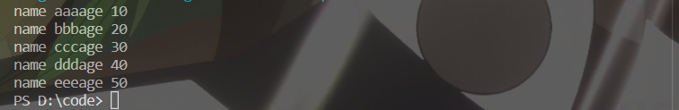

通过代码运行我们可以简单的理解为vector容器就是一个存放数组类型的容器。

### string容器

#### 构造函数

- string(); //创建一个空的字符串 例如: string str; 
- string(const char* s); //使用字符串s初始化 
- string(const string& str); //使用一个string对象初始化另一个string对象  **拷贝构造函数**
- string(int n, char c); //使用n个字符c初始化

示例：

```C++
//构造函数
#include <iostream>
#include <string>
using namespace std;

void test(){
    //默认构造
    string str1;
    //字符串初始化
    const char* str = "hello world";
    string str2(str);
    cout <<"str2="<<str2<<endl;
    //拷贝构造函数
    string str3(str2);
    cout<<"str3="<<str3<<endl;
    //n个字符初始化
    string str4(10,'a');
    cout<<"str4="<<str4<<endl;
}

int main(){
    test();
    return 0;
}
```

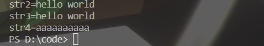

#### 字符串赋值

- string& operator=(const char* s); //char*类型字符串 赋值给当前的字符串 
- string& operator=(const string &s); //把字符串s赋给当前的字符串 
- string& operator=(char c); //字符赋值给当前的字符串 
- string& assign(const char *s); //把字符串s赋给当前的字符串 
- string& assign(const char *s, int n); //把字符串s的前n个字符赋给当前的字符串 
- string& assign(const string &s); //把字符串s赋给当前字符串 
- string& assign(int n, char c); //用n个字符c赋给当前字符

示例

```c++
//字符串赋值
#include <iostream>
#include <string>
using namespace std;
void test(){
    //char*类型字符串 赋值给当前的字符串 
    string str1;
    str1="hello world";
    cout <<"str1="<<str1<<endl;
    //把字符串s赋给当前的字符串 
    string str2=str1;
    cout <<"str2="<<str2<<endl;
    //字符赋值给当前的字符串 
    string str3;
    str3='a';
    cout <<"str3="<<str3<<endl;
    //把字符串s赋给当前的字符串 
    string str4;
    str4.assign("hello STL");
    cout <<"str4="<<str4<<endl;
    //把字符串s的前n个字符赋给当前的字符串 
    string str5;
    str5.assign(str1,5);
    cout <<"str5="<<str5<<endl;
    //把字符串s赋给当前字符串 
    string str6;
    str6.assign(str1);
    cout <<"str6="<<str6<<endl;
    //用n个字符c赋给当前字符
    string str7;
    str7.assign(10,'w');
    cout <<"str7="<<str7<<endl;


}
int main(){
    test();
    return 0;
}
```

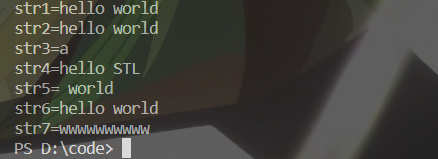

#### 字符串拼接

- string& operator+=(const char* str); //重载+=操作符 
- string& operator+=(const char c); //重载+=操作符 
- string& operator+=(const string& str); //重载+=操作符 
- string& append(const char *s); //把字符串s连接到当前字符串结尾 
- string& append(const char *s, int n); //把字符串s的前n个字符连接到当前字符串结尾 
- string& append(const string &s); //同operator+=(const string& str) 
- string& append(const string &s, int pos, int n); //字符串s中从pos开始的n个字符连接到字符串结尾

示例

```C++
//字符串拼接
#include <iostream>
#include <string>
using namespace std;

void test(){
    //重载+=操作符 1
    string str1;
    str1 = "I ";
    str1+="Love game";
    cout <<"str1="<<str1<<endl;
    //重载+=操作符 2
    str1+='.';
    cout <<"str1="<<str1<<endl;
    //重载+=操作符 3
    string str2;
    str2 = " No,you don't";
    str1+=str2;
    cout <<"str1="<<str1<<endl;
    //把字符串s连接到当前字符串结尾 
    str1.append(" ....");
    cout <<"str1="<<str1<<endl;
    //把字符串s的前n个字符连接到当前字符串结尾 
    str1.append(" bey sdfsdfasdhf",4);
    cout <<"str1="<<str1<<endl;
    //同operator+=(const string& str) 
    string str3;
    str3 = " aaaa";
    str1.append(str3);
    cout <<"str1="<<str1<<endl;
    //字符串s中从pos开始的n个字符连接到字符串结尾 */
    str1.append(str3,0,3);
    cout <<"str1="<<str1<<endl;
}
int main(){
    test();
    return 0;
}
```

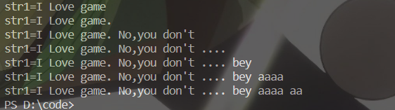

#### 字符串查找替换

- int find(const string& str, int pos = 0) const; //查找str第一次出现位置,从pos开始查找 
- int find(const char* s, int pos = 0) const; //查找s第一次出现位置,从pos开始查找 
- int find(const char* s, int pos, int n) const; //从pos位置查找s的前n个字符第一次位置 
- int find(const char c, int pos = 0) const; //查找字符c第一次出现位置 
- int rfind(const string& str, int pos = npos) const; //查找str最后一次位置,从pos开始查找 
- int rfind(const char* s, int pos = npos) const; //查找s最后一次出现位置,从pos开始查找 
- int rfind(const char* s, int pos, int n) const; //从pos查找s的前n个字符最后一次位置 
- int rfind(const char c, int pos = 0) const; //查找字符c最后一次出现位置 
- string& replace(int pos, int n, const string& str); //替换从pos开始n个字符为字符串str 
- string& replace(int pos, int n,const char* s); //替换从pos开始的n个字符为字符串s

示例

```C++
#include <iostream>
#include <string>
using namespace std;
//查找
void test01(){
    //使用find
    string str = "abcdefg_de";
    if(str.find("de")==-1){
        cout <<"find erro"<<endl;
    }else{
        cout <<"find success,this point is "<<str.find("de")<<endl;
    }
    if(str.find("dg")==-1){
        cout <<"find erro"<<endl;
    }else{
        cout <<"find success,this point is "<<str.find("de")<<endl;
    }
    //使用rfind
    if(str.rfind("de")==-1){
        cout <<"rfind erro"<<endl;
    }else{
        cout <<"rfind success,this point is "<<str.rfind("de")<<endl;
    }
    if(str.rfind("dg")==-1){
        cout <<"rfind erro"<<endl;
    }else{
        cout <<"rfind success,this point is "<<str.rfind("de")<<endl;
    }
    //find是从左向右找，rfind是从右往左找
}
//替换
void test02(){
    string str = "abcdefg";
    str.replace(1,3,"1111");//把一号位置后面三个位置替换为1111
    cout <<"str="<<str<<endl;
}
int main(){
    test01();
    test02();
    return 0;
}
```

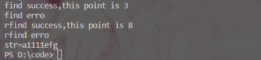

#### 字符串比较和存取

- int compare(const string &s) const; //与字符串s比较 
- int compare(const char *s) const; //与字符串s比较
- char& operator[] (int n); //通过[]方式取字符 
- char& at(int n); //通过at方法获取字符

示例

```c++
#include <iostream>
#include <string>
using namespace std;
//字符串比较
void test01(){
    string str1 ="hello";
    string str2 ="hello";
    if(str1.compare(str2)==0){
        cout <<"str1 == str2"<<endl;
    }else{
        cout <<"str1!=str2"<<endl;
    }

}
//字符串存取
void test02(){
    //通过[]方式取字符 
    string str ="hello";
    for(int i =0; i<str.size();i++){
         cout <<str[i]<<" ";
    }
    cout << endl;
    //通过at方法获取字符
    for(int i =0; i<str.size();i++){
         cout <<str.at(i)<<" ";
    }
    cout << endl;
    //修改字符串中的字符
    str[0]='x';
    str.at(1)='m';
    cout <<"str="<<str<<endl;
}
int main(){
    test01();
    cout <<"-------------"<<endl;
    test02();
    return 0;
}
```

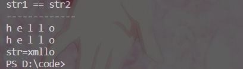

#### 字符串插入与删除

- string& insert(int pos, const char* s); //插入字符串 
- string& insert(int pos, const string& str); //插入字符串 
- string& insert(int pos, int n, char c); //在指定位置插入n个字符c 
- string& erase(int pos, int n = npos); //删除从Pos开始的n个字符

示例

```C++
#include <iostream>
#include <string>
using namespace std;

//插入字符串
void test01(){
    string str1 = "hello ";
    string str2 = "world";
    str1.insert(6,str2);
    cout <<"str1="<<str1<<endl;
    //在指定位置插入n个字符c 
    str1.insert(11,1,' ');
    str1.insert(12,3,'m');
    cout <<"str1="<<str1<<endl;
}
//删除字符串
void test02(){
    string str = "asdjfhldskjhf";
    str.erase(3,5);
    cout <<"str="<<str<<endl;

}
int main(){
    test01();
    test02();
    return 0;
}
```

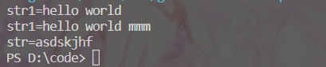

####  字符串子串

- string substr(int pos = 0, int n = npos) const; //返回由pos开始的n个字符组成的字符串

示例

```C++
#include<string>
#include<iostream>
using namespace std;
//截取用户名
void test(){
    string emil = "zhangfsdf@qq.com";
    int pos=emil.find("@");
    string emilUser = emil.substr(0,pos);
    cout <<"emilUser is "<<emilUser<<endl;
}

int main(){
    test();
    return 0;
}
```

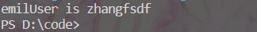

### vector容器

vector数据结构和数组非常相似，也称为单端数组，不同之处在于数组是静态空间，而vector可以动态扩展

**动态扩展并不是在原空间之后续接新空间，而是找更大的内存空间，然后将原数据拷贝新空间，释放原空间**


#### 构造函数

- vector v; //采用模板实现类实现，默认构造函数 
- vector(v.begin(), v.end()); //将v[begin(), end())区间中的元素拷贝给本身
- vector(n, elem); //构造函数将n个elem拷贝给本身
- vector(const vector &vec); //拷贝构造函数

示例

```C++
#include <iostream>
#include <vector>
using namespace std;
void printVector(vector<int>& t){
    for(vector<int>::iterator it=t.begin();it!=t.end();it++){
        cout <<(*it)<<" ";
    }
    cout << endl;
}
void test(){
    //采用模板实现类实现，默认构造函数 
    vector<int>a;
    for(int i=0;i<10;i++){
        a.push_back(i);
    }
    printVector(a);
    //将v[begin(), end())区间中的元素拷贝给本身
    vector<int>b(a.begin(),a.end());
    printVector(b);
    //构造函数将n个elem拷贝给本身
    vector<int>c(10,100);
    printVector(c);
    //拷贝构造函数
    vector<int>d(c);
    printVector(d);
}
int main(){
    test();
    return 0;
}
```

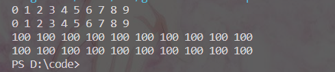

#### vector赋值

- vector& operator=(const vector &vec); //重载等号操作符
- assign(beg, end); //将[beg, end)区间中的数据拷贝赋值给本身
- assign(n, elem); //将n个elem拷贝赋值给本身

示例

```c++
#include <iostream>
#include <vector>
using namespace std;
void printVector(vector<int>& t){
    for(vector<int>::iterator it=t.begin();it!=t.end();it++){
        cout <<(*it)<<" ";
    }
    cout << endl;
}
void test(){
    vector<int>a;
    for(int i=0;i<10;i++){
        a.push_back(i);
    }
    printVector(a);
    //重载等号操作符
    vector<int>b;
    b=a;
    printVector(b);
    //将[beg, end)区间中的数据拷贝赋值给本身
    vector<int>c;
    c.assign(b.begin(),b.end());
    printVector(c);
    //将n个elem拷贝赋值给本身
    vector<int>d;
    d.assign(10,100);
    printVector(d);
}
int main(){
    test();
    return 0;
}
```

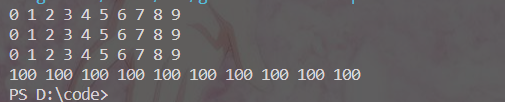

#### vector容量和大小

- empty(); //判断容器是否为空 
- capacity(); //容器的容量 
- size(); //返回容器中元素的个数 
- resize(int num); //重新指定容器的长度为num，若容器变长，则以默认值填充新位置。 //如果容器变短，则末尾超出容器长度的元素被删除
- resize(int num, elem); //重新指定容器的长度为num，若容器变长，则以elem值填充新位置。 //如果容器变短，则末尾超出容器长度的元素被删除

示例

```C++
#include<iostream>
#include<vector>
using namespace std;
void printVector(vector<int>& t){
    for(vector<int>::iterator it=t.begin();it!=t.end();it++){
        cout<<(*it)<<" ";
    }
    cout << endl;
}
void test(){
    vector<int>a;
    for(int i = 0;i<10;i++){
        a.push_back(i);
    }
    printVector(a);
    //如果是空的
    if(a.empty()){
        cout<<"a is empty"<<endl;
    }else{
        cout<<"a is not empty "<<endl;
        cout<<"a capacity is "<<a.capacity()<<endl;
        cout<<"a size is "<<a.size()<<endl;
    }
    a.resize(15,1);//重设size大小，多余的空间用1填充
    printVector(a);
    a.resize(5);//设置的比原来小，把后面多的删除了
    printVector(a);
}
int main(){
    test();
    return 0;
}
```

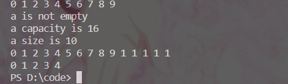

#### vector插入和删除

- push_back(ele); //尾部插入元素ele 
- pop_back(); //删除最后一个元素 
- insert(const_iterator pos, ele); //迭代器指向位置pos插入元素ele 
- insert(const_iterator pos, int count,ele); //迭代器指向位置pos插入count个元素ele 
- erase(const_iterator pos); //删除迭代器指向的元素 
- erase(const_iterator start, const_iterator end); //删除迭代器从start到end之间的元素 
- clear(); //删除容器中所有元素

```C++
#include<iostream>
#include<vector>
using namespace std;
void printVector(vector<int>& t){
    for(vector<int>::iterator it=t.begin();it!=t.end();it++){
        cout <<*it<<" ";
    }
    cout << endl;
}
void test(){
    vector<int>a;
    //尾部插入元素ele 
    a.push_back(10);
    a.push_back(20);
    a.push_back(30);
    a.push_back(40);
    a.push_back(50);
    //遍历
    printVector(a);
    //删除最后一个元素 
    a.pop_back();
    printVector(a);
    //迭代器指向位置pos插入元素ele
    a.insert(a.begin()+2,3); //在第二个位置插入一个3
    printVector(a);
    //迭代器指向位置pos插入count个元素ele 
    a.insert(a.begin(),3,100);//在开始位置插入三个100
    printVector(a);
    //删除迭代器指向的元素 
    a.erase(a.begin());
    printVector(a);
    //删除迭代器从start到end之间的元素 
    a.erase(a.begin(),a.begin()+2);
    printVector(a);
    //删除容器中所有元素
    a.clear();
    if(a.empty()){
        cout<<"a is empty"<<endl;
    }else{
        cout<<"a is not empty "<<endl;
        cout<<"a capacity is "<<a.capacity()<<endl;
        cout<<"a size is "<<a.size()<<endl;
    }
}
int main(){
    test();
    return 0;
}
```

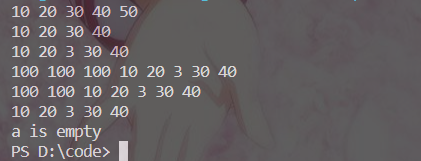

#### vector数据存取

- at(int idx); //返回索引idx所指的数据 
- operator[]; //返回索引idx所指的数据 
- front(); //返回容器中第一个数据元素 
- back(); //返回容器中最后一个数据元素

示例

```C++
#include <iostream>
#include <vector>
using namespace std;
void test(){
    vector<int>v;
    for(int i;i<v.size();i++){
        v.push_back(i);
    }
    //返回索引idx所指的数据
    for(int i = 0; i<10;i++){
        cout <<v.at(i)<< " ";
    }
    cout << endl;
    //返回索引idx所指的数据
    for(int i = 0; i<10;i++){
        cout <<v[i]<< " ";
    } 
    cout << endl;
    //返回容器中第一个数据元素
    cout <<"第一个数据元素 "<<v.front()<<endl;
    //返回容器中最后一个数据元素
    cout <<"最后一个数据元素 "<<v.back()<<endl;
}

int main(){
    test();
    return 0;
}
```

#### vector互换容器

实现两个容器内元素进行互换

- swap(vec); // 将vec与本身的元素互换

示例

```C++
#include <iostream>
#include <vector>
using namespace std;
void printVector(vector<int> t)
{
    for(vector<int>::iterator it = t.begin();it!=t.end();it++){
        cout << *it <<" ";
    }
    cout << endl;
}
void test(){
    vector<int>a;
    vector<int>b;
    for(int i = 0;i<10;i++){
        a.push_back(i);
    }
    for(int i = 10;i>0;i--){
        b.push_back(i);
    }
    cout <<"交换前"<<endl;
    printVector(a);
    printVector(b);
    cout <<"交换后"<<endl;
    a.swap(b);
    printVector(a);
    printVector(b);
}
int main(){
    test();
    return 0;
}
```

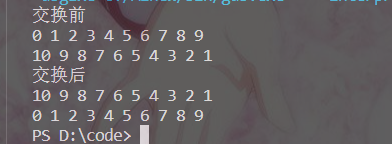

#### vector预留空间

- reserve(int len); //容器预留len个元素长度，预留位置不初始化，元素不可访问

示例

```C++
#include <iostream>
#include <vector>
using namespace std;
//不预留空间，看看空间开辟次数
void test01(){
    vector<int>a;
    int num=0;
    int *p = NULL;
    for(int i = 0;i<100000;i++){
        a.push_back(i);
        if(p!=&a[0]){
            p=&a[0];
            num++;//因为每次重新开辟，头地址都会换位置，可以这么统计开辟次数
        }
    }
    cout <<"开辟次数:"<<num<<endl;
}
//预留空间
void test02(){
    vector<int>a;
    a.reserve(100000);
    int num=0;
    int *p = NULL;
    for(int i = 0;i<100000;i++){
        a.push_back(i);
        if(p!=&a[0]){
            p=&a[0];
            num++;
        }
    }
    cout <<"开辟次数:"<<num<<endl;
}
int main(){
    test01();
    test02();
    return 0;
}
```

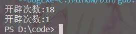

### deque容器

双端数组，可以对头端进行插入删除操作

deque与vector的区别

- vector对于头部的插入删除效率低，数据量越大，效率越低 deque相对而言，
- 对头部的插入删除速度回比vector快 
- vector访问元素时的速度会比deque快,这和两者内部实现有关


**deque内部有个中控器，维护每段缓冲区中的内容，缓冲区中存放真实数据 中控器维护的是每个缓冲区的地址，使得使用deque时像一片连续的内存空间**


#### deque构造函数

- deque deqT; //默认构造形式 
- deque(beg, end); //构造函数将[beg, end)区间中的元素拷贝给本身
- deque(n, elem); //构造函数将n个elem拷贝给本身
- deque(const deque &deq); //拷贝构造函数

示例

```C++
#include <iostream>
#include <deque>
using namespace std;
void printDeque(const deque<int>& t){
    for(deque<int>::const_iterator it = t.begin(); it!=t.end();it++){
        cout <<*it<<" ";
    }
    cout << endl;
}
void test(){
    //默认构造形式
    deque<int>a;
    for(int i = 0; i < 10; i++){
        a.push_back(i);
    }
    printDeque(a);
    //构造函数将[beg, end)区间中的元素拷贝给本身
    deque<int>b(a.begin()+5,a.end());
    printDeque(b);
    //构造函数将n个elem拷贝给本身
    deque<int>c(10,100);
    printDeque(c);
    //拷贝构造函数
    deque<int>d(c);
    printDeque(d);
}
int main(){
    test();
    return 0;
}

```

与vector的构造基本一致

#### deque赋值操作

- deque& operator=(const deque &deq); //重载等号操作符 
- assign(beg, end); //将[beg, end)区间中的数据拷贝赋值给本身
- assign(n, elem); //将n个elem拷贝赋值给本身

示例

```C++
#include <iostream>
#include <deque>
using namespace std;
void printDeque(const deque<int>& t){
    for(deque<int>::const_iterator it = t.begin(); it!=t.end();it++){
        cout <<*it<<" ";
    }
    cout << endl;
}
void test(){
    deque<int>a;
    for(int i = 0; i < 10; i++){
        a.push_back(i);
    }
    printDeque(a);
    //重载等号操作符 
    deque<int>b;
    b=a;
    printDeque(b);
    //将[beg, end)区间中的数据拷贝赋值给本身
    deque<int>c;
    c.assign(b.begin()+5,b.end()-2);
    printDeque(c);
    //将n个elem拷贝赋值给本身
    deque<int>d;
    d.assign(10,100);
    printDeque(d);
}
int main(){
    test();
    return 0;
}

```

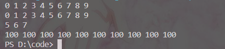

与vector基本相同

####  deque大小操作

- deque.empty(); //判断容器是否为空
- deque.size(); //返回容器中元素的个数 
- deque.resize(num); //重新指定容器的长度为num,若容器变长，则以默认值填充新位置。 //如果容器变短，则末尾超出容器长度的元素被删除 
- deque.resize(num, elem); //重新指定容器的长度为num,若容器变长，则以elem值填充新位置。 //如果容器变短，则末尾超出容器长度的元素被删除

示例

```C++
#include <iostream>
#include <deque>
using namespace std;
void printDeque(const deque<int>& t){
    for(deque<int>::const_iterator it = t.begin(); it!=t.end();it++){
        cout <<*it<<" ";
    }
    cout << endl;
}
void test(){
    //判断容器是否为空
    deque<int>a;
    deque<int>b;
    for(int i = 0; i < 10; i++){
        a.push_back(i);
    }
    if(a.empty()){
        cout <<"这个容器是空的"<<endl;
    }else{
        cout <<"这个容器不是空的且";
        //返回容器中元素的个数 
        cout << "这个容器的size为: "<<a.size()<<endl;
    }
    if(b.empty()){
        cout <<"这个容器是空的"<<endl;
    }else{
        cout <<"这个容器不是空的"<<endl;
        //返回容器中元素的个数 
        cout << "这个容器的size为: "<<a.size()<<endl;
    }
    //重新指定容器的长度为num,若容器变长，则以默认值填充新位置。 //如果容器变短，则末尾超出容器长度的元素被删除 
    a.resize(15);
    printDeque(a);
    a.resize(5);
    printDeque(a);
}
int main(){
    test();
    return 0;
}
```

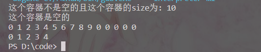

**deque没有容量的概念**

#### deque 插入和删除

两端插入操作：

- push_back(elem); //在容器尾部添加一个数据 
- push_front(elem); //在容器头部插入一个数据 
- pop_back(); //删除容器最后一个数据 
- pop_front(); //删除容器第一个数据

指定位置操作：

- insert(pos,elem); //在pos位置插入一个elem元素的拷贝，返回新数据的位置。 
- insert(pos,n,elem); //在pos位置插入n个elem数据，无返回值。 
- insert(pos,beg,end); //在pos位置插入[beg,end)区间的数据，无返回值。 
- clear(); //清空容器的所有数据 
- erase(beg,end); //删除[beg,end)区间的数据，返回下一个数据的位置。 
- erase(pos); //删除pos位置的数据，返回下一个数据的位置。

示例

```C++
#include <iostream>
#include <deque>
using namespace std;
void printDeque(const deque<int>& t){
    for(deque<int>::const_iterator it = t.begin(); it!=t.end();it++){
        cout <<*it<<" ";
    }
    cout << endl;
}
void test01(){
    //判断容器是否为空
    deque<int>a;
    deque<int>b;
    a.push_back(10);
    a.push_back(20);
    a.push_back(30);
    a.push_back(40);
    a.push_back(50);
    cout <<"在容器a尾部添加一个数据"<<endl;
    printDeque(a);
    b.push_front(10);
    b.push_front(20);
    b.push_front(30);
    b.push_front(40);
    b.push_front(50);
    cout <<"在容器b头部插入一个数据"<<endl;
    printDeque(b);
    cout <<"删除容器a最后一个数据"<<endl;
    a.pop_back();
    printDeque(a);
    cout <<"删除容器d第一个数据"<<endl;
    b.pop_front();
    printDeque(b);

}
/* insert(pos,elem); //在pos位置插入一个elem元素的拷贝，返回新数据的位置。
insert(pos,n,elem); //在pos位置插入n个elem数据，无返回值。
insert(pos,beg,end); //在pos位置插入[beg,end)区间的数据，无返回值。
clear(); //清空容器的所有数据
erase(beg,end); //删除[beg,end)区间的数据，返回下一个数据的位置。
erase(pos); //删除pos位置的数据，返回下一个数据的位置。
 */
void test02(){
    //判断容器是否为空
    deque<int>a;
    deque<int>b;
    a.push_back(10);
    a.push_back(20);
    a.push_back(30);
    a.push_back(40);
    a.push_back(50);
    b.push_front(1);
    b.push_front(2);
    b.push_front(3);
    b.push_front(4);
    b.push_front(5);
    cout <<"在pos位置插入一个elem元素的拷贝"<<endl;
    a.insert(a.begin(),100);
    printDeque(a);
    cout<<"在pos位置插入n个elem数据"<<endl;
    a.insert(a.begin(),3,10);
    printDeque(a);
    cout<<"在pos位置插入[beg,end)区间的数据"<<endl;
    a.insert(a.begin(),b.begin(),b.end());
    printDeque(a);
    cout<<"删除[beg,end)区间的数据"<<endl;
    a.erase(a.begin()+1,a.begin()+4);
    printDeque(a);
    cout <<"删除pos位置的数据"<<endl;
    a.erase(a.end());
    printDeque(a);
}
int main(){
    test01();
    test02();
    return 0;
}

```

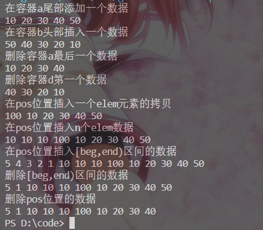

####  deque 数据存取

- at(int idx); //返回索引idx所指的数据 
- operator[]; //返回索引idx所指的数据 
- front(); //返回容器中第一个数据元素
- back(); //返回容器中最后一个数据元素

示例

```C++
#include <iostream>
#include <deque>
using namespace std;
void printDeque(const deque<int>& t){
    for(deque<int>::const_iterator it = t.begin(); it!=t.end();it++){
        cout <<*it<<" ";
    }
    cout << endl;
}
void test(){
    //默认构造形式
    deque<int>a;
    for(int i = 0; i < 10; i++){
        a.push_back(i);
    }
    cout <<"返回索引idx所指的数据 at(5)="<<a.at(5)<<" a[4]="<<a[4]<<endl;
    cout <<"返回容器中第一个数据元素 a.front()="<<a.front()<<endl;
    cout <<"返回容器中最后一个数据元素 a.back()="<<a.back()<<endl;
    printDeque(a);

}
int main(){
    test();
    return 0;
}
```

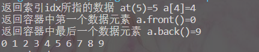

#### deque 排序

利用算法实现对deque容器进行排序

- sort(iterator beg, iterator end) //对beg和end区间内元素进行排序

示例

```C++
#include <iostream>
#include <deque>
#include <algorithm>
using namespace std;
void printDeque(const deque<int>& t){
    for(deque<int>::const_iterator it = t.begin(); it!=t.end();it++){
        cout <<*it<<" ";
    }
    cout << endl;
}
void test(){
    //默认构造形式
    deque<int>a;
    a.push_back(12);
    a.push_back(43);
    a.push_back(21);
    a.push_back(1);
    a.push_back(90);
    a.push_back(3);
    printDeque(a);
    sort(a.begin(),a.end());
    printDeque(a);
}
int main(){
    test();
    return 0;
}
```

sort算法非常实用，使用时包含头文件 algorithm即可

### stack容器

stack是一种先进后出(First In Last Out,FILO)的数据结构，它只有一个出口

- 
- 栈中只有顶端的元素才可以被外界使用，因此栈不允许有遍历行为 
- 栈中进入数据称为 --- 入栈 push 
- 栈中弹出数据称为 --- 出栈 pop

#### 常用接口

构造函数

- stack stk; //stack采用模板类实现， stack对象的默认构造形式 
- stack(const stack &stk); //拷贝构造函数

赋值操作：

- stack& operator=(const stack &stk); //重载等号操作符

数据存取：

- push(elem); //向栈顶添加元素 
- pop(); //从栈顶移除第一个元素
- top(); //返回栈顶元素

大小操作：

- empty(); //判断堆栈是否为空
- size(); //返回栈的大小

示例

```C++
#include<iostream>
#include<stack>
using namespace std;
void test(){
    //构造函数创建
    stack<int>a;
    //数据存取，向栈中添加元素，叫做 压栈 入栈
    a.push(10);
    a.push(20);
    a.push(30);
    a.push(40);
    a.push(50);
    cout <<"这个栈的大小是:"<<a.size()<<endl;
    //栈是不能遍历的
    while(!a.empty()){
        //查看栈顶数据
        cout <<"栈顶数据是:"<<a.top()<<endl;
        //出栈
        a.pop();
    }
    cout <<"这个栈的大小是:"<<a.size()<<endl;
}
int main(){
    test();
    return 0;
}
```

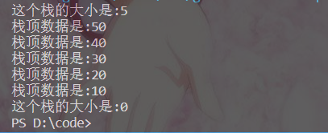

###  queue容器

Queue是一种先进先出(First In First Out,FIFO)的数据结构，它有两个出口


- 队列容器允许从一端新增元素，从另一端移除元素 
- 队列中只有队头和队尾才可以被外界使用，因此队列不允许有遍历行为 
- 队列中进数据称为 --- 入队 push 
- 队列中出数据称为 --- 出队 pop

#### 常用接口

构造函数：

- queue que; //queue采用模板类实现，queue对象的默认构造形式 
- queue(const queue &que); //拷贝构造函数

赋值操作：

- queue& operator=(const queue &que); //重载等号操作符

数据存取：

- push(elem); //往队尾添加元素 
- pop(); //从队头移除第一个元素
- back(); //返回最后一个元素 
- front(); //返回第一个元素

大小操作：

- empty(); //判断堆栈是否为空 
- size(); //返回栈的大小

示例

```C++
#include<iostream>
#include<string>
#include<queue>
using namespace std;
class Person{
public:
    friend void test();
    Person(int age,string name){
        this->age=age;
        this->name=name;
    }
private:
    int age;
    string name;
};

void test(){
    //构造函数
    queue<Person>a;
    //数据存取
    Person p1(19,"张三");
    Person p2(20,"李四");
    Person p3(25,"王二");
    Person p4(18,"刘五");
    a.push(p1);
    a.push(p2);
    a.push(p3);
    a.push(p4);
    cout <<"这个队列大小是:"<<a.size()<<endl;
    while(!a.empty()){
        cout<<"排头的名字和年龄分别是"<<a.front().name<<" "<<a.front().age<<endl;
        cout<<"排尾的名字和年龄分别是"<<a.back().name<<" "<<a.back().age<<endl;
        //出队
        a.pop();
    }
    cout <<"这个队列大小是:"<<a.size()<<endl;
}
int main(){
    test();
    return 0;
}
```

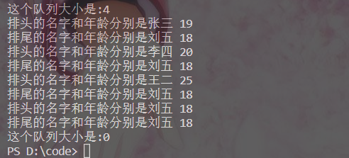

### list容器

链表（list）是一种物理存储单元上非连续的存储结构，数据元素的逻辑顺序是通过链表中的指针链接实现的

**链表的组成：链表由一系列结点组成**

**结点的组成：一个是存储数据元素的数据域，另一个是存储下一个结点地址的指针域**


由于链表的存储方式并不是连续的内存空间，因此链表list中的迭代器只支持前移和后移，**属于双向迭代器**

list的优缺点：

- 采用动态存储分配，不会造成内存浪费和溢出 
- 链表执行插入和删除操作十分方便，修改指针即可，不需要移动大量元素
- 链表灵活，但是空间(指针域) 和 时间（遍历）额外耗费较大

#### list构造函数

- list lst; //list采用采用模板类实现,对象的默认构造形式：
- list(beg,end); //构造函数将[beg, end)区间中的元素拷贝给本身
- list(n,elem); //构造函数将n个elem拷贝给本身
- list(const list &lst); //拷贝构造函数

示例

```C++
#include<iostream>
#include<list>
using namespace std;
void printList(const list<int>& t){
    for(list<int>::const_iterator it = t.begin();it!=t.end();it++){
        cout <<*it<<" ";
    }
    cout << endl;
}
void test(){
    
    list<int>a;
    a.push_back(10);
    a.push_back(20);
    a.push_back(30);
    a.push_back(40);
    a.push_back(50);
    cout<<"list采用采用模板类实现,对象的默认构造形式："<<endl;
    printList(a);
    a.pop_front();
    a.pop_back();
    cout <<"构造函数将[beg, end)区间中的元素拷贝给本身"<<endl;
    list<int>b(a.begin(),a.end());
    printList(b);
    cout <<"构造函数将n个elem拷贝给本身"<<endl;
    list<int>c(5,10);
    printList(c);
    c.pop_back();
    c.pop_front();
    cout <<"拷贝构造函数"<<endl;
    list<int>d(c);
    printList(d);
}
int main(){
    test();
    return 0;
}
```

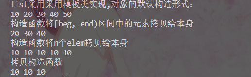

#### list 赋值和交换

- 给list容器进行赋值，以及交换list容器
- assign(beg, end); //将[beg, end)区间中的数据拷贝赋值给本身
- assign(n, elem); //将n个elem拷贝赋值给本身
- list& operator=(const list &lst); //重载等号操作符 
- swap(lst); //将lst与本身的元素互换

示例

```C++
#include <iostream>
#include <list>
using namespace std;
void printList(const list<int>& t){
    for(list<int>::const_iterator it = t.begin();it!=t.end();it++){
        cout <<*it <<" ";
    }
    cout << endl;
}
void test(){
    list<int>a;
    for(int i = 0;i<10;i++){
        a.push_back(i);
    }
    cout <<"将[beg, end)区间中的数据拷贝赋值给本身。"<<endl;
    list<int>b;
    b.assign(a.begin(),a.end());
    printList(b);
    cout <<"将n个elem拷贝赋值给本身。"<<endl;
    list<int>c(10,5);
    printList(c);
    cout <<"重载等号操作符"<<endl;
    a.pop_back();
    a.pop_front();
    list<int>d;
    d=a;
    printList(d);
    cout <<"将lst与本身的元素互换"<<endl;
    d.swap(b);
    printList(d);
}
int main()
{
    test();
    return 0;
}
```

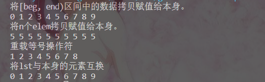

####  list 大小操作

- size(); //返回容器中元素的个数 
- empty(); //判断容器是否为空 
- resize(num); //重新指定容器的长度为num，若容器变长，则以默认值填充新位置。 //如果容器变短，则末尾超出容器长度的元素被删除。 
- resize(num, elem); //重新指定容器的长度为num，若容器变长，则以elem值填充新位置。 //如果容器变短，则末尾超出容器长度的元素被删除。

示例

```C++
#include <iostream>
#include <list>
using namespace std;
void printList(const list<int>& t){
    for(list<int>::const_iterator it = t.begin();it!=t.end();it++){
        cout <<*it <<" ";
    }
    cout << endl;
}
void if_empty(const list<int>& t){
    if(t.empty()){
        cout <<"这个容器是空的"<<endl;
    }else{
        cout <<"这个容器不是空的,其中的元素个数为:"<<t.size()<<endl;
    }
}
void test(){
    list<int>a;
    list<int>b;
    for(int i = 0;i<10;i++){
        a.push_back(i);
    }
    if_empty(a);
    if_empty(b);
    cout <<"重新指定容器的长度为num,重载版本"<<endl;
    b.resize(10,1);
    printList(b);
}
int main()
{
    test();
    return 0;
}
```

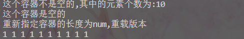

#### list 插入和删除

- push_back(elem);//在容器尾部加入一个元素 
- pop_back();//删除容器中最后一个元素 
- push_front(elem);//在容器开头插入一个元素 
- pop_front();//从容器开头移除第一个元素 
- insert(pos,elem);//在pos位置插elem元素的拷贝，返回新数据的位置
- insert(pos,n,elem);//在pos位置插入n个elem数据，无返回值
- insert(pos,beg,end);//在pos位置插入[beg,end)区间的数据，无返回值
- clear();//移除容器的所有数据
- erase(beg,end);//删除[beg,end)区间的数据，返回下一个数据的位置
- erase(pos);//删除pos位置的数据，返回下一个数据的位置
- remove(elem);//删除容器中所有与elem值匹配的元素

示例

```C++
#include <iostream>
#include <list>
using namespace std;
void printList(const list<int>& t){
    for(list<int>::const_iterator it = t.begin();it!=t.end();it++){
        cout <<*it <<" ";
    }
    cout << endl;
}
void test(){
    list<int>a;
    list<int>b;
    a.push_back(10);
    a.push_back(20);
    a.push_back(30);
    a.push_back(40);
    a.push_back(50);
    cout <<"在a容器尾部加入一个元素 "<<endl;
    printList(a);
    cout <<"删除a容器中最后一个元素 "<<endl;
    a.pop_back();
    printList(a);
    b.push_front(10);
    b.push_front(20);
    b.push_front(30);
    b.push_front(40);
    b.push_front(50);
    cout <<"在容器b开头插入一个元素 "<<endl;
    printList(b);
    cout <<"删除容器b中第一个元素"<<endl;
    b.pop_front();
    printList(b);
    cout <<"在pos位置插elem元素的拷贝"<<endl;
    list<int>::iterator it = a.begin();
    a.insert(++it,114514);
    printList(a);
    cout <<"删除容器中所有与elem值匹配的元素"<<endl;
    b.remove(30);
    printList(b);
    cout <<"输入想删除pos位置的数据"<<endl;
    int n;
    cin>>n;
    it=a.begin();
    for(int i=0;i<n-1;i++){
        it++;
    }
    a.erase(it);
    printList(a);
}
int main()
{
    test();
    return 0;
}
```

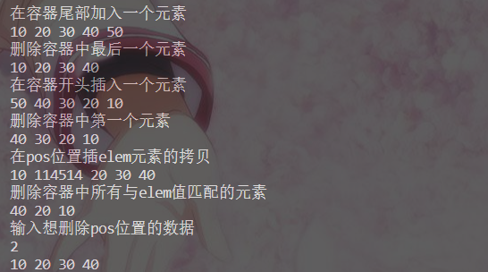

#### list 数据存取

- front(); //返回第一个元素
- back(); //返回最后一个元素

示例

```C++
#include <iostream>
#include <list>
using namespace std;
void test(){
    list<int>a;
    a.push_back(10);
    a.push_back(20);
    a.push_back(30);
    a.push_back(40);
    a.push_back(50);
    cout<<"链表a第一个元素是:"<<a.front()<<endl;
    cout<<"链表a最后一个元素是:"<<a.back()<<endl;
    //cout << L1.at(0) << endl;//错误 不支持at访问数据
    //cout << L1[0] << endl; //错误 不支持[]方式访问数据
}   
int main()
{
    test();
    return 0;
}
```

 list<int>::iterator it = a.begin()+1; 错误的写法

it= it+1；这也是错误的写法

**因为list容器的迭代器是双向迭代器，不支持随机访问**

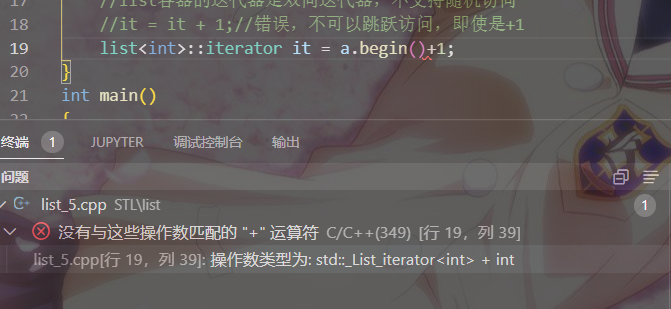

#### list 反转和排序

- 将容器中的元素反转，以及将容器中的数据进行排序
- reverse(); //反转链表 
- sort(); //链表排序   这个sort不再是\#include <algorithm> 中的，而是成员函数

```C++
#include <iostream>
#include <list>
using namespace std;
void printList(const list<int>& t){
    for(list<int>::const_iterator it = t.begin();it!=t.end();it++){
        cout <<*it <<" ";
    }
    cout << endl;
}
void test(){
    list<int>a;
    list<int>b;
    a.push_back(10);
    a.push_back(20);
    a.push_back(30);
    a.push_back(40);
    a.push_back(50);
    cout<<"反转链表前"<<endl;
    printList(a);
    cout<<"反转链表后"<<endl;
    a.reverse();
    printList(a);
    b.push_front(23);
    b.push_front(43);
    b.push_front(34);
    b.push_front(9);
    b.push_front(12);
    cout <<"链表排序前"<<endl;
    printList(b);
    cout <<"链表排序后"<<endl;
    b.sort();
    printList(b);
}
int main()
{
    test();
    return 0;
}
```

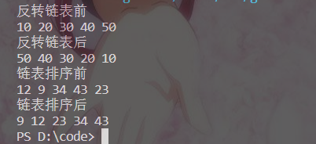

### set/ multiset 容器

所有元素都会在插入时自动被排序

set/multiset属于关联式容器，底层结构是用二叉树实现

**set不允许容器中有重复的元素 multiset允许容器中有重复的元素**

#### set构造和赋值

- set st; //默认构造函数
- set(const set &st); //拷贝构造函数
- set& operator=(const set &st); //重载等号操作符

示例

```C++
#include <iostream>
#include <set>
using namespace std;
void printSet(const set<int>& t){
    for(set<int>::const_iterator it = t.begin();it!=t.end();it++){
        cout<<*it<<" ";
    }
    cout << endl;
}
void test(){
    set<int>a;
    a.insert(20);
    a.insert(50);
    a.insert(30);
    a.insert(10);
    a.insert(40);
    cout <<"默认构造函数"<<endl;
    printSet(a);
    cout <<"拷贝构造函数"<<endl;
    set<int>b(a);
    printSet(b);
    cout <<"重载等号操作符"<<endl;
    set<int>c;
    c=a;
    printSet(c);
}   
int main(){
    test();
    return 0;
}
```

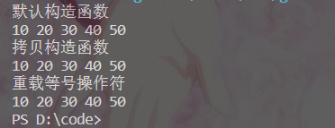

**set容器插入数据时用insert**

#### set大小和交换

- size(); //返回容器中元素的数目
- empty(); //判断容器是否为空 
- swap(st); //交换两个集合容器

示例

```C++
#include <iostream>
#include <set>
using namespace std;
void printSet(const set<int>& t){
    for(set<int>::const_iterator it = t.begin();it!=t.end();it++){
        cout<<*it<<" ";
    }
    cout << endl;
}
void if_empty(const set<int>& t){
    if(t.empty()){
        cout <<"这个容器是空的"<<endl;
    }else{
        cout<<"这个容器不是空的,并且容器大小为:"<<t.size()<<endl;
    }
}
void test(){
    set<int>a;
    a.insert(20);
    a.insert(50);
    a.insert(30);
    a.insert(10);
    a.insert(40);
    set<int>b;
    b.insert(1);
    b.insert(5);
    b.insert(2);
    b.insert(4);
    b.insert(3);
    set<int>c;
    if_empty(a);
    if_empty(c);
    cout <<"交换前"<<endl;
    printSet(a);
    printSet(b);
    cout <<"交换后"<<endl;
    a.swap(b);
    printSet(a);
    printSet(b);
}   
int main(){
    test();
    return 0;
}
```

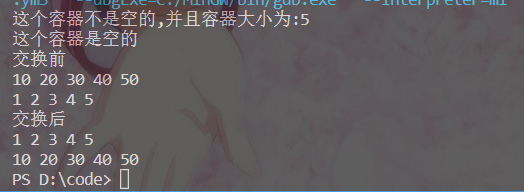

####  set插入和删除

- insert(elem); //在容器中插入元素
- clear(); //清除所有元素
- erase(pos); //删除pos迭代器所指的元素，返回下一个元素的迭代器
- erase(beg, end); //删除区间[beg,end)的所有元素 ，返回下一个元素的迭代器
- erase(elem); //删除容器中值为elem的元素

示例

```C++
#include <set>
#include <iostream>
using namespace std;
void printSet(set<int> &s)
{
    for (set<int>::iterator it = s.begin(); it != s.end(); it++)
    {
        cout << *it << " ";
    }
    cout << endl;
}
// 插入和删除

void test01()
{
    set<int> s1;
    // 插入
    s1.insert(10);
    s1.insert(30);
    s1.insert(20);
    s1.insert(40);
    printSet(s1);
    // 删除
    s1.erase(s1.begin());
    printSet(s1);
    s1.erase(30);
    printSet(s1);
    // 清空
    // s1.erase(s1.begin(), s1.end());
    s1.clear();
    printSet(s1);
}
int main()
{
    test01();
    system("pause");
    return 0;
}

```

与前面基本一致

#### set查找和统计

- find(key); //查找key是否存在,若存在，返回该键的元素的迭代器；若不存在，返回set.end(); 
- count(key); //统计key的元素个数，返回值是0 或者 1

```C++
#include <iostream> 
#include <set>
using namespace std;
void test(){
    set<double>a;
    a.insert(1.0);
    a.insert(4.0);
    a.insert(2.0);
    a.insert(3.0);
    a.insert(5.0);
    set<double>::iterator it = a.find(3.0);
    if(it!=a.end()){
        cout <<"找到了这个元素"<<endl;
    }else{
        cout<<"没找到这个元素"<<endl;
    }
    int m = a.count(1.0);
    int n = a.count(223);
    cout <<m<<endl;
    cout <<n<<endl;
}
int main(){
    test();
    return 0;
}
```

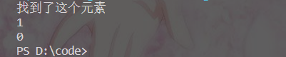

#### set和multiset区别

- set不可以插入重复数据，而multiset可以 
- set插入数据的同时会返回插入结果，表示插入是否成功 
- multiset不会检测数据，因此可以插入重复数据

示例

```C++
#include <iostream>
#include <set>
using namespace std;
void test(){
    set<int>a;
    //判断是否插入成功 
    pair<set<int>::iterator,bool> ret = a.insert(10);
    if(ret.second){
        cout<<"插入成功"<<endl;
    }else{
        cout<<"插入失败"<<endl;
    }
    ret = a.insert(10);
    if(ret.second){
        cout<<"插入成功"<<endl;
    }else{
        cout<<"插入失败"<<endl;
    }
    multiset<int>b;
    b.insert(10);
    b.insert(10);
    b.insert(10);
    b.insert(10);
    for(multiset<int>::iterator it = b.begin();it!=b.end();it++){
        cout<<*it<<" ";
    }
    cout << endl;
}   
int main(){
    test();
    return 0;
}
```

**multise用法基本一样，只是multiset允许插入重复的数据**

#### pair对组创建

成对出现的数据，利用对组可以返回两个数据

创建方式：

- pair p ( value1, value2 ); 
- pair p = make_pair( value1, value2 );

示例

```C++
#include <iostream>
#include <string>
using namespace std;
int main(){
    pair<string,int>a("张三",18);
    pair<string,int> b = make_pair("李四",20);
    cout <<"第一个人叫"<<a.first<<"年龄是"<<a.second<<endl;
    cout <<"第二个人叫"<<b.first<<"年龄是"<<b.second<<endl;
    return 0;
}
```

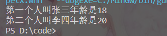

#### set容器排序

**set是会默认从小到大排序，利用仿函数，可以改变排序规则**

示例

```C++
#include <iostream>
#include <set>
#include <string>
using namespace std;
class Person{
public:
    string name;
    int age;
    int hight;
    Person(string name,int age,int hight){
        this->name=name;
        this->age=age;
        this->hight=hight;
    }
};
class MyCompare
{
public:
    bool operator()(const Person& p1,const Person& p2) const{
        if(p1.age == p2.age){
            return p1.hight < p2.hight;
        }else{
            return p1.age < p2.age;
        }
    }  
};
void test(){
    Person a1("张三",18,170);
    Person a2("李四",22,165);
    Person a3("王二",22,180);
    Person a4("刘五",22,190);
    Person a5("陈七",17,176);
    set<Person,MyCompare>a;
    a.insert(a1);
    a.insert(a2);
    a.insert(a3);
    a.insert(a4);
    a.insert(a5);
    for (set<Person, MyCompare>::iterator it = a.begin(); it != a.end(); it++){
        cout << "姓名： " << it->name << " 年龄： " << it->age << "身高："<<it->hight<<endl;
    }

}
int main(){
    test();
    return 0;
}
```

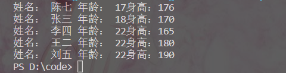

### map/ multimap容器

- map中所有元素都是pair 
- pair中第一个元素为key（键值），起到索引作用，
- 第二个元素为value（实值） 所有元素都会根据元素的键值自动排序
- map/multimap属于关联式容器，底层结构是用二叉树实现
- 可以根据key值快速找到value值

- map不允许容器中有重复key值元素 
- multimap允许容器中有重复key值元素

**是不能重复key值而不是value值**

#### map构造和赋值

- map mp; //map默认构造函数
- map(const map &mp); //拷贝构造函数
- map& operator=(const map &mp); //重载等号操作符

示例

```C++
#include <iostream>
#include <map>
using namespace std;
void printMap(const map<int,int>& t ){
    for(map<int,int>::const_iterator it = t.begin();it!=t.end();it++){
        cout <<it->first<<" "<<it->second<<" ";
        cout << endl;
    }       
    cout << endl;
}
void test(){
    map<int,int>m;
    m.insert(pair<int,int>(1,10));
    m.insert(pair<int,int>(2,20));
    m.insert(pair<int,int>(3,30));
    m.insert(pair<int,int>(4,40));
    m.insert(pair<int,int>(5,50));
    cout <<"默认构造"<<endl;
    printMap(m);
    map<int,int>n(m);
    cout <<"拷贝构造"<<endl;
    printMap(n);
    map<int,int>s;
    s=m;
    cout <<"赋值"<<endl;
    printMap(s);
}
int main(){
    test();
    return 0;
}
```

**map中所有元素都是成对出现，插入数据时候要使用对组**

#### map大小和交换

- size(); //返回容器中元素的数目 
- empty(); //判断容器是否为空 
- swap(st); //交换两个集合容器

示例

```C++
#include <iostream>
#include <map>
using namespace std;
void printMap(const map<int,int>& t ){
    for(map<int,int>::const_iterator it = t.begin();it!=t.end();it++){
        cout <<it->first<<" "<<it->second<<"|";
    }       
    cout << endl;
}
void if_empty(const map<int,int>& t ){
    if(t.empty()){
        cout <<"这个容器是空的"<<endl;
    }else{
        cout <<"这个容器不是空的,大小为"<<t.size()<<endl;
    }
}
void test(){
    map<int,int>m;
    map<int,int>n;
    m.insert(pair<int,int>(1,10));
    m.insert(pair<int,int>(2,20));
    m.insert(pair<int,int>(3,30));
    m.insert(pair<int,int>(4,40));
    m.insert(pair<int,int>(5,50));
    if_empty(m);
    if_empty(n);
    map<int,int>s;
    s.insert(pair<int,int>(1,22));
    s.insert(pair<int,int>(2,32));
    cout <<"交换前"<<endl;
    printMap(m);
    printMap(s);
    cout <<"交换后"<<endl;
    m.swap(s);
    printMap(m);
    printMap(s);
}
int main(){
    test();
    return 0;
}
```

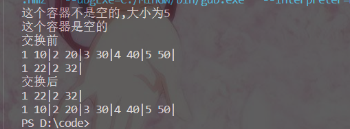

####  map插入和删除

- insert(elem); //在容器中插入元素。 
- clear(); //清除所有元素 
- erase(pos); //删除pos迭代器所指的元素，返回下一个元素的迭代器。
- erase(beg, end); //删除区间[beg,end)的所有元素 ，返回下一个元素的迭代器。 
- erase(key); //删除容器中值为key的元素。

示例

```C++
#include <iostream>
#include <map>
using namespace std;
void printMap(const map<int,int>& t ){
    for(map<int,int>::const_iterator it = t.begin();it!=t.end();it++){
        cout <<it->first<<" "<<it->second<<"|";
    }       
    cout << endl;
}
void if_empty(const map<int,int>& t ){
    if(t.empty()){
        cout <<"这个容器是空的"<<endl;
    }else{
        cout <<"这个容器不是空的,大小为"<<t.size()<<endl;
    }
}
void test(){
    map<int,int>m;
    //插入方式一
    m.insert(pair<int,int>(1,10));
    //插入方式二
    m.insert(make_pair(2,20));
    //插入方式三
    m.insert(map<int,int>::value_type(3,30));
    //插入方式四
    m[4]=40;
    printMap(m);
    map<int,int>::iterator it = m.begin();
    m.erase(++it);
    cout<<"删除元素"<<endl;
    printMap(m);
    cout<<"删除key为3的元素"<<endl;
    m.erase(3);
    printMap(m);
    cout<<"清空数据"<<endl;
    m.clear();
    if_empty(m);
}
int main(){
    test();
    return 0;
}
```

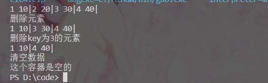

#### map查找和统计

- find(key); //查找key是否存在,若存在，返回该键的元素的迭代器；若不存在，返回set.end(); 
- count(key); //统计key的元素个数

示例

```C++
#include <map>
#include <iostream>
using namespace std;
// 查找和统计
void test01()
{
    map<int, int> m;
    m.insert(pair<int, int>(1, 10));
    m.insert(pair<int, int>(2, 20));
    m.insert(pair<int, int>(3, 30));
    // 查找
    map<int, int>::iterator pos = m.find(3);
    if (pos != m.end())
    {
        cout << "找到了元素 key = " << (*pos).first << " value = " << (*pos).second << endl;
    }
    else
    {
        cout << "未找到元素" << endl;
    }
    // 统计
    int num = m.count(3);
    cout << "num = " << num << endl;
}
int main()
{
    test01();
    system("pause");
    return 0;
}
```

find的返回值还是迭代器

count的返回值不是0就是1

####  map容器排序

默认的是从小到大，利用仿函数，可以改变排序规则

示例

```C++
#include <map>
#include <iostream>
using namespace std;
class MyCompare
{
public:
    bool operator()(int v1, int v2) const
    {
        return v1 > v2;
    }
};
void test01()
{
    // 默认从小到大排序
    // 利用仿函数实现从大到小排序
    map<int, int, MyCompare> m;
    m.insert(make_pair(1, 10));
    m.insert(make_pair(2, 20));
    m.insert(make_pair(3, 30));
    m.insert(make_pair(4, 40));
    m.insert(make_pair(5, 50));
    for (map<int, int, MyCompare>::iterator it = m.begin(); it != m.end(); it++)
    {
        cout << "key:" << it->first << " value:" << it->second << endl;
    }
}
int main()
{
    test01();
    system("pause");
    return 0;
}
```

基本上与其他的容器排序方法相同，同样这里可以排序自定义类型

## 函数对象

### 函数对象

- 重载函数调用操作符的类，其对象常称为函数对象 
- 函数对象使用重载的()时，行为类似函数调用，也叫仿函数

**函数对象(仿函数)是一个类，不是一个函数**

函数对象的使用：

- 函数对象在使用时，可以像普通函数那样调用, 可以有参数，可以有返回值 
- 函数对象超出普通函数的概念，函数对象可以有自己的状态 
- 函数对象可以作为参数传递

示例

```C++
#include <iostream>
#include <string>
using namespace std;
class Myadd{
public:
    int operator()(int a,int b){
        return a + b;
    }
};
class Myprint{
public:
    Myprint(){
        count = 0;
    }
    void operator()(string a){
        cout << a << endl;
        count++;
    }
    int count;
};

void doPrint(Myprint& t,string p){
    t(p);
}

void test(){
   cout <<"函数对象在使用时，可以像普通函数那样调用, 可以有参数，可以有返回值"<<endl;
    Myadd myadd;
    cout <<"myadd(10,30)="<<myadd(10,30)<<endl;
    cout <<"函数对象超出普通函数的概念，函数对象可以有自己的状态"<<endl;
    Myprint myprint;
    myprint("hello world");
    myprint("hello world");
    myprint("hello world");
    myprint("hello world");
    cout <<"一共打印了"<<myprint.count<<"次"<<endl;
    cout <<"函数对象可以作为参数传递"<<endl;
    doPrint(myprint,"hello C++");
}
int main(){
    test();
    return 0;
}
```

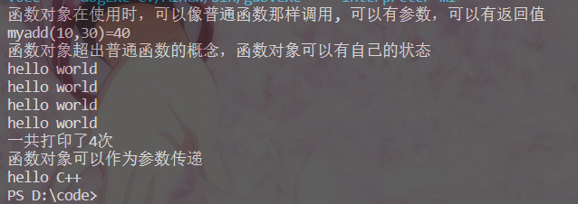

**仿函数写法非常灵活，可以作为参数进行传递。**

### 谓词

- 返回bool类型的仿函数称为谓词 
- 如果operator()接受一个参数，那么叫做一元谓词 
- 如果operator()接受两个参数，那么叫做二元谓词

#### 一元谓词

示例

```C++
#include <iostream>
#include <vector>
#include <algorithm>
using namespace std;

class My{
public:
    bool operator()(int a){
        return a>5;
    }
};

void test(){
    vector<int>a;
    for(int i = 0; i<10; i++){
        a.push_back(i);
    }
    vector<int>::iterator it = find_if(a.begin(),a.end(),My());//My()是匿名函数
    //这里使用了find_if算法
    if(it == a.end()){
        cout <<"没有找到" <<endl;
    }else{
        cout <<"找到了大于5的数为:"<<*it<<endl;
    }
}
int main(){
    test();
    return 0;
}
```

#### 二元谓词

sort算法默认是从小到大排序，利用仿函数可以改成从大到小排序

```C++
#include <vector>
#include <algorithm>
#include <iostream>
using namespace std;
// 二元谓词
class MyCompare
{
public:
    bool operator()(int num1, int num2)
    {
        return num1 > num2;
    }
};
void test01()
{
    vector<int> v;
    v.push_back(10);
    v.push_back(40);
    v.push_back(20);
    v.push_back(30);
    v.push_back(50);
    // 默认从小到大
    sort(v.begin(), v.end());
    for (vector<int>::iterator it = v.begin(); it != v.end(); it++)
    {
        cout << *it << " ";
    }
    cout << endl;
    cout << "----------------------------" << endl;
    // 使用函数对象改变算法策略，排序从大到小
    sort(v.begin(), v.end(), MyCompare());
    for (vector<int>::iterator it = v.begin(); it != v.end(); it++)
    {
        cout << *it << " ";
    }
    cout << endl;
}
int main()
{
    test01();
    return 0;
}
```

###  内建函数对象

- STL内建了一些函数对象
- 这些仿函数所产生的对象，用法和一般函数完全相同
- 使用内建函数对象，需要引入头文件 #include< functional>

分类：

- 算术仿函数 
- 关系仿函数
- 逻辑仿函数

#### 算术函数

- 实现四则运算 
- 其中negate是一元运算，其他都是二元运算
- template T plus //加法仿函数 
- template T minus //减法仿函数 
- template T multiplies //乘法仿函数
- template T divides //除法仿函数
- template T modulus //取模仿函数 
- template T negate //取反仿函数

示例

```C++
#include <iostream>
#include <functional>
using namespace std;
void test(){
    cout <<"negate()"<<endl;
    negate<int>a;
    cout <<"10取反是"<<a(10)<<endl;
    cout <<"plus()"<<endl;
    plus<int>b;
    cout <<"10+1="<<b(10,1)<<endl;
    cout <<"modulus()"<<endl;
    modulus<int>c;
    cout<<"3模2等于"<<c(3,2)<<endl;
}
int main(){
    test();
    return 0;
}
```

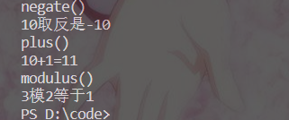

#### 关系仿函数

- template bool equal_to //等于
- template bool not_equal_to //不等于
- template bool greater //大于
- template bool greater_equal //大于等于
- template bool less //小于
- template bool less_equal //小于等于

在二元谓词的时候我们自己写了sort从大到小的排序，这里就可以直接使用关系仿函数

示例

```C++
#include <iostream>
#include <functional>
#include <vector>
#include <algorithm>
using namespace std;
void test(){
    vector<int>a;
    a.push_back(21);
    a.push_back(12);
    a.push_back(31);
    a.push_back(2);
    a.push_back(11);
    cout <<"排序前"<<endl;
    for(vector<int>::iterator it =a.begin();it!=a.end();it++){
        cout <<*it<<" ";
    }
    cout << endl;
    sort(a.begin(),a.end(),greater<int>());
    cout <<"排序后"<<endl;
    for(vector<int>::iterator it =a.begin();it!=a.end();it++){
        cout <<*it<<" ";
    }
    cout << endl;
}
int main(){
    test();
    return 0;
}
```

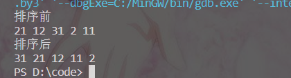

#### 逻辑仿函数

- template bool logical_and //逻辑与
- template bool logical_or //逻辑或
- template bool logical_not //逻辑非

示例

```C++
#include <vector>
#include <functional>
#include <algorithm>
#include <iostream>
using namespace std;
void test01()
{
    vector<bool> v;
    v.push_back(true);
    v.push_back(false);
    v.push_back(true);
    v.push_back(false);
    for (vector<bool>::iterator it = v.begin(); it != v.end(); it++)
    {
        cout << *it << " ";
    }
    cout << endl;
    // 逻辑非 将v容器搬运到v2中，并执行逻辑非运算
    vector<bool> v2;
    v2.resize(v.size());//不开辟空间不能运行
    transform(v.begin(), v.end(), v2.begin(), logical_not<bool>());
    for (vector<bool>::iterator it = v2.begin(); it != v2.end(); it++)
    {
        cout << *it << " ";
    }
    cout << endl;
}
int main()
{
    test01();
    return 0;
}
```

## 常用算法

- 算法主要是由头文件< algorithm>,< functional>,< numeric>组成。 

- < algorithm>是所有STL头文件中最大的一个，范围涉及到比较、 交换、查找、遍历操作、复制、修改等等 
- < numeric>体积很小，只包括几个在序列上面进行简单数学运算的模板函数 
- < functional>定义了一些模板类,用以声明函数对象。

### 遍历算法

- for_each //遍历容器 
- transform //搬运容器到另一个容器中

#####  for_each

函数原型：

1. for_each(iterator beg, iterator end, _func);
2. 遍历算法 遍历容器元素  
3. beg 开始迭代器 
4. end 结束迭代器 
5. _func 函数或者函数对象

示例

```C++
#include <iostream>
#include <vector>
#include <algorithm>
using namespace std;
void print(int a){
    cout <<a<<" ";
}
class Myprint{
public:
    void operator()(int a){
        cout <<a<<" ";
    }
};
void test(){
    vector<int>a;
    a.push_back(10);
    a.push_back(20);
    a.push_back(30);
    a.push_back(40);
    a.push_back(50);
    cout <<"普通函数"<<endl;
    for_each(a.begin(),a.end(),print);
    cout << endl;
    cout <<"函数对象"<<endl;
    for_each(a.begin(),a.end(),Myprint());
}
int main(){
    test();
    return 0;
}
```

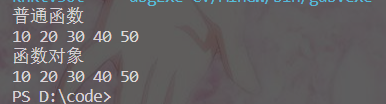

**普通函数是不用加括号的，函数对象要加上括号创建匿名函数**

##### transform

函数原型：

1. transform(iterator beg1, iterator end1, iterator beg2, _func)
2. beg1 源容器开始迭代器
3. end1 源容器结束迭代器
4. beg2 目标容器开始迭代器
5. _func 函数或者函数对象

示例

```C++
#include <vector>
#include <functional>
#include <algorithm>
#include <iostream>
using namespace std;
void print(int a){
    cout <<a<<" ";
}
class Tranform{
public:
    int operator()(int a){
        return a-1;//这里的返回值要是int，相当于先把值传给这个函数运算后再返回给v2
    }
};
void test01()
{
    vector<int> v;
    v.push_back(12);
    v.push_back(13);
    v.push_back(14);
    v.push_back(15);
    cout <<"v的数据是"<<endl;
    for_each(v.begin(),v.end(),print);
    cout << endl;
    vector<int> v2;
    v2.resize(v.size());//不开辟空间不能运行
    cout<<"把v中的元素都-1再传入v2"<<endl;
    transform(v.begin(), v.end(), v2.begin(),Tranform());
    cout <<"v2的数据是"<<endl;
    for_each(v2.begin(),v2.end(),print);
}
int main()
{
    test01();
    return 0;
}
```

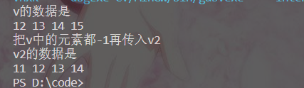

###  查找算法

- find //查找元素 

- find_if //按条件查找元素 

- adjacent_find //查找相邻重复元素 

- binary_search //二分查找法 

- count //统计元素个数 

- count_if //按条件统计元素个数

##### find

查找指定元素，找到返回指定元素的迭代器，找不到返回结束迭代器end()

函数原型：

1. find(iterator beg, iterator end, value); 
2. 按值查找元素，找到返回指定位置迭代器，找不到返回结束迭代器位置 
3. beg 开始迭代器 
4. end 结束迭代器 
5. value 查找的元素
6. 返回值是迭代器

示例：

```C++
#include <iostream>
#include <vector>
#include <algorithm>
#include <string>
using namespace std;
//查找自定义数据类型
class Person{
public:
    Person(string name,int age,int hight){
        this->name = name;
        this->age = age;
        this->hight = hight;
    }
    //对于自定义的类型,使用find是重载 == 符号，不然find不知道怎么比较
    bool operator==(const Person& p1){
        if(this->name == p1.name &&
        this->age == p1.age &&
        this->hight == p1.hight){
            return true;
        }else{
            return false;
        }
    }

    string name;
    int age;
    int hight;
};

void test(){
    Person a1("张三",18,170);
    Person a2("李四",22,165);
    Person a3("王二",22,180);
    Person a4("刘五",22,190);
    Person a5("陈七",17,176);
    Person aa("张三",18,170);
    vector<Person>v;
    v.push_back(a1);
    v.push_back(a2);
    v.push_back(a3);
    v.push_back(a4);
    v.push_back(a5);
    vector<Person>::iterator it = find(v.begin(),v.end(),aa);
    if(it == v.end()){
        cout <<"没有找"<<endl;
    }else{
        cout <<"找到了"<<it->name<<" "<<it->age<<" "<<it->hight<<endl;
    }
}
int main(){
    test();
    return 0;
}
```

**在查找定义类型的时候一定要重载==符号**

##### find_if

按条件查找元素

函数原型：

1. find_if(iterator beg, iterator end, _Pred); 
2. 按值查找元素，找到返回指定位置迭代器，找不到返回结束迭代器位置 
3. beg 开始迭代器 
4. end 结束迭代器 
5. _Pred 函数或者谓词（返回bool类型的仿函数）
6. 返回值是迭代器

示例

```C++
//所有找年龄大于20的人
/* find(iterator beg, iterator end, value);  */
#include <iostream>
#include <vector>
#include <algorithm>
#include <string>
using namespace std;
//查找自定义数据类型
class Person{
public:
    Person(string name,int age,int hight){
        this->name = name;
        this->age = age;
        this->hight = hight;
    }
    //使用一元谓词
    bool operator()(const Person& p1){
        return p1.age > this->age;
    }
    string name;
    int age;
    int hight;
};
class My{
public:
    //使用一元谓词
    bool operator()(const Person& p1){
        return p1.age > 20;
    }
};


void test(){
    Person a1("陈七",17,176);
    Person a2("李四",11,165);
    Person a3("张三",18,170);
    Person a4("王二",11,180);
    Person a5("刘五",19,190);
    vector<Person>v;
    v.push_back(a1);
    v.push_back(a2);
    v.push_back(a3);
    v.push_back(a4);
    v.push_back(a5);
    vector<Person>::iterator it = find_if(v.begin(),v.end(),My());
    if(it == v.end()){
        cout <<"没有找"<<endl;
    }else{
        cout <<"找到了"<<it->name<<" "<<it->age<<" "<<it->hight<<endl;
    }
}
int main(){
    test();
    return 0;
}
```

find_if通过仿函数改变查找条件

##### adjacent_find

查找相邻重复元素

函数原型：

1. adjacent_find(iterator beg, iterator end); 
2. 查找相邻重复元素,返回相邻元素的第一个位置的迭代器 
3. beg 开始迭代器 
4. end 结束迭代器
5. 返回值是迭代器

示例

```C++
#include <iostream>
#include <vector>
#include <algorithm>
#include <string>
using namespace std;

void test(){
    vector<int>v;
    v.push_back(1);
    v.push_back(2);
    v.push_back(3);
    v.push_back(3);
    v.push_back(4);
    vector<int>::iterator it = adjacent_find(v.begin(),v.end());
    if(it == v.end()){
        cout <<"没有找重复的数"<<endl;
    }else{
        cout<<"找到了重复的数字:"<<*it<<endl;
    }
}
int main(){
    test();
    return 0;
}
```

##### binary_search

查找指定元素是否存在

函数原型：

1. bool binary_search(iterator beg, iterator end, value); 
2. 查找指定的元素，查到 返回true 否则false 
3. beg 开始迭代器 
4. end 结束迭代器 
5. value 查找的元素
6. 返回值是bool

**二分查找，在无序序列中不可用 **

示例

```C++
#include <iostream>
#include <vector>
#include <algorithm>
#include <string>
using namespace std;

void test(){
    vector<int>v;
    v.push_back(1);
    v.push_back(2);
    v.push_back(3);
    v.push_back(4);
    v.push_back(5);
    bool ret = binary_search(v.begin(),v.end(),3);
    if(ret){
        cout<<"找到了"<<endl;
    }else{
        cout<<"没有找到"<<endl;
    }
}
int main(){
    test();
    return 0;
}
```

##### count

统计元素个数

函数原型：

1. count(iterator beg, iterator end, value); 
2. beg 开始迭代器 
3. end 结束迭代器 
4. value 统计的元素
5. 返回值是int

示例：

```C++
#include <iostream>
#include <vector>
#include <algorithm>
#include <string>
using namespace std;
class Person{
public:
    Person(string name,int age,int hight){
        this->name = name;
        this->age = age;
        this->hight = hight;
    }
    //对于自定义的类型,使用find是重载 == 符号，不然find不知道怎么比较
    bool operator==(const Person& p1){
        if(this->age == p1.age){
            return true;
        }else{
            return false;
        }
    }

    string name;
    int age;
    int hight;
};
//找到年龄为22的人出现次数
void test(){
    Person a1("张三",18,170);
    Person a2("李四",22,165);
    Person a3("王二",22,180);
    Person a4("刘五",22,190);
    Person a5("陈七",17,176);
    Person aa("张三",22,170);
    vector<Person>v;
    v.push_back(a1);
    v.push_back(a2);
    v.push_back(a3);
    v.push_back(a4);
    v.push_back(a5);
    int num= count(v.begin(),v.end(),aa);
    if(num == 0){
        cout <<"没有找年龄为22的人"<<endl;
    }else{
        cout <<"找到了年龄为22的有"<<num<<"个人"<<endl;
    }
}
int main(){
    test();
    return 0;
}
```

自定义的数据类型比较还是要重载运算符

##### count_if

按条件统计元素个数

函数原型：

1. count_if(iterator beg, iterator end, _Pred); 
2. 按条件统计元素出现次数 
3. beg 开始迭代器 
4. end 结束迭代器 
5. _Pred 谓词
6. 返回值是int

示例

```C++
#include <iostream>
#include <vector>
#include <algorithm>
#include <string>
using namespace std;
class Person{
public:
    Person(string name,int age,int hight){
        this->name = name;
        this->age = age;
        this->hight = hight;
    }
    string name;
    int age;
    int hight;
};
class My{
public:
    //使用一元谓词
    bool operator()(const Person& p1){
        return p1.age > 22;
    }
};

//找到年龄为22的人出现次数
void test(){
    Person a1("张三",18,170);
    Person a2("李四",22,165);
    Person a3("王二",23,180);
    Person a4("刘五",25,190);
    Person a5("陈七",17,176);
    vector<Person>v;
    v.push_back(a1);
    v.push_back(a2);
    v.push_back(a3);
    v.push_back(a4);
    v.push_back(a5);
    int num= count_if(v.begin(),v.end(),My());//第三个参数是谓词
    if(num == 0){
        cout <<"没有找年龄大于22的人"<<endl;
    }else{
        cout <<"找到了年龄大于22的有"<<num<<"个人"<<endl;
    }
}
int main(){
    test();
    return 0;
}
```

### 排序算法

- sort 对容器内元素进行排序 
- random_shuffle 洗牌 指定范围内的元素随机调整次序 
- merge  容器元素合并，并存储到另一容器中 
- reverse  反转指定范围的元素

##### sort

对容器内元素进行排序

函数原型 ：

1. sort(iterator beg, iterator end, _Pred);   按值查找元素，找到返回指定位置迭代器，找不到返回结束迭代器位置 
2. beg 开始迭代器 
3. end 结束迭代器 
4. _Pred 谓词

示例

```C++
#include <iostream>
#include <vector>
#include <algorithm>
#include <functional>
using namespace std;
void myPrint(int a){
    cout <<a<<" ";
}
void test(){
    vector<int>a;
    a.push_back(2);
    a.push_back(4);
    a.push_back(1);
    a.push_back(5);
    a.push_back(3);
    cout <<"从小到大排序"<<endl;
    sort(a.begin(),a.end());
    for_each(a.begin(),a.end(),myPrint);//这里调用函数不用写()
    cout << endl;
    cout <<"从大到小排序"<<endl;
    sort(a.begin(),a.end(),greater<int>());
    for_each(a.begin(),a.end(),myPrint);
}
int main(){
    test();
    return 0;
}
```

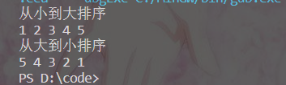

##### random_shuffle

指定范围内的元素随机调整次序

函数原型：

1. random_shuffle(iterator beg, iterator end); 
2. 指定范围内的元素随机调整次序 
3. beg 开始迭代器 
4. end 结束迭代器

示例

```C++
#include <iostream>
#include <vector>
#include <algorithm>
#include <ctime>
using namespace std;
void myPrint(int a){
    cout <<a<<" ";   
}
void test(){
    //设置随机数种子
    srand((unsigned int)time(NULL));
    vector<int>a;
    for(int i =0;i<10;i++){
        a.push_back(i);
    }
    random_shuffle(a.begin(),a.end());//如果不设置随机数种子那么每次运行生成的随机数都一样
    for_each(a.begin(),a.end(),myPrint);
}
int main(){
    test();
    return 0;
}
```

##### merge

两个容器元素合并，并存储到另一容器中

函数原型：

merge(iterator beg1, iterator end1, iterator beg2, iterator end2, iterator dest); 

1.  beg1 容器1开始迭代器 
2.  end1 容器1结束迭代器 
3.  beg2 容器2开始迭代器 
4.  end2 容器2结束迭代器 
5.  dest 目标容器开始迭代器

**两个容器必须都是有序的**

示例

```C++
#include <algorithm>
#include <vector>
#include <iostream>
using namespace std;
class myPrint
{
public:
    void operator()(int val)
    {
        cout << val << " ";
    }
};
void test01()
{
    vector<int> v1;
    vector<int> v2;
    for (int i = 0; i < 10; i++)
    {
        v1.push_back(i);
        v2.push_back(i + 1);
    }
    vector<int> vtarget;
    // 目标容器需要提前开辟空间
    vtarget.resize(v1.size() + v2.size());
    // 合并 需要两个有序序列
    merge(v1.begin(), v1.end(), v2.begin(), v2.end(), vtarget.begin());
    for_each(vtarget.begin(), vtarget.end(), myPrint());
    cout << endl;
}
int main()
{
    test01();
    return 0;
}
```

合并两个容器中的元素，相同的元素在一起并且会自动排序

##### reverse

将容器内元素进行反转

函数原型：

1. reverse(iterator beg, iterator end); 
2. 反转指定范围的元素 
3. beg 开始迭代器
4. end 结束迭代器

示例

```C++
#include <algorithm>
#include <vector>
#include <iostream>
#include <string>
using namespace std;
void myPrint(string a){
    cout <<a;   
}
void test(){
    vector<string>a;
    a.push_back("zhang");
    a.push_back("jin");
    a.push_back("wei");
    for_each(a.begin(),a.end(),myPrint);
    cout << endl;
    reverse(a.begin(),a.end());
    for_each(a.begin(),a.end(),myPrint);

}
int main(){
    test();
    return 0;
}
```

### 拷贝和替换算法

- copy                 容器内指定范围的元素拷贝到另一容器中
- replace             将容器内指定范围的旧元素修改为新元素
- replace_if         容器内指定范围满足条件的元素替换为新元素
- swap                 互换两个容器的元素

##### copy

容器内指定范围的元素拷贝到另一容器中

函数原型：

1. copy(iterator beg, iterator end, iterator dest);

2. 按值查找元素，找到返回指定位置迭代器，找不到返回结束迭代器位置

3. beg  开始迭代器

4. end  结束迭代器

5. dest 目标起始迭代器

示例

```C++
#include <algorithm>
#include <vector>
#include <iostream>
using namespace std;
class myPrint
{
public:
	void operator()(int a)
	{
        cout << a << " ";
	}
};
void test01()
{
	vector<int> v1;
	for (int i = 0; i < 10; i++) {
		v1.push_back(i + 1);
	}
	vector<int> v2;
	v2.resize(v1.size());//要提前开辟空间
	copy(v1.begin(), v1.end(), v2.begin());
	for_each(v2.begin(), v2.end(), myPrint());
	cout << endl;
}
int main() {
	test01();
	return 0;
}
```

##### replace

将容器内指定范围的旧元素修改为新元素

函数原型：

1. replace(iterator beg, iterator end, oldvalue, newvalue); 
2. 将区间内旧元素 替换成 新元素 
3. beg 开始迭代器 
4. end 结束迭代器 
5. oldvalue 旧元素
6. newvalue 新元素

示例

```C++
#include <algorithm>
#include <vector>
#include <iostream>
using namespace std;
class myPrint
{
public:
	void operator()(int a)
	{
        cout << a << " ";
	}
};
void test01()
{
	vector<int> v1;
    v1.push_back(10);
    v1.push_back(20);
    v1.push_back(20);
    v1.push_back(30);
    v1.push_back(40);
    cout<<"替换前"<<endl;
	for_each(v1.begin(), v1.end(), myPrint());
    cout << endl;
    cout<<"替换后"<<endl;
    //把20替换成11
    replace(v1.begin(),v1.end(),20,11);
	for_each(v1.begin(), v1.end(), myPrint());
	cout << endl;
}
int main() {
	test01();
	return 0;
}
```

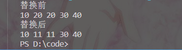

##### replace_if

将区间内满足条件的元素，替换成指定元素

函数原型：

1. replace_if(iterator beg, iterator end, _pred, newvalue); 
2. 按条件替换元素，满足条件的替换成指定元素 
3. beg 开始迭代器 
4. end 结束迭代器
5. _pred 谓词 
6. newvalue 替换的新元素

示例

```C++
#include <algorithm>
#include <vector>
#include <iostream>
using namespace std;
class myPrint
{
public:
	void operator()(int a)
	{
        cout << a << " ";
	}
};
class My{
public:
    bool operator()(int t){
        return t >= 30;
    }
};

void test01()
{
	vector<int> v1;
    v1.push_back(10);
    v1.push_back(20);
    v1.push_back(20);
    v1.push_back(30);
    v1.push_back(40);
    cout<<"替换前"<<endl;
	for_each(v1.begin(), v1.end(), myPrint());
    cout << endl;
    cout<<"替换后"<<endl;
    //把大于等于30的数替换成11
    replace_if(v1.begin(),v1.end(),My(),11);
	for_each(v1.begin(), v1.end(), myPrint());
	cout << endl;
}
int main() {
	test01();
	return 0;
}
```

##### swap

互换两个容器的元素

函数原型：

- swap(container c1, container c2); 
- 互换两个容器的元素 
- c1容器1 
- c2容器2

**要交换的两个容器必须是同种类型**

示例

```C++
#include <algorithm>
#include <vector>
#include <iostream>
using namespace std;
class myPrint
{
public:
	void operator()(int a)
	{
        cout << a << " ";
	}
};
void test01()
{
	vector<int> v1;
	for (int i = 0; i < 10; i++) {
		v1.push_back(i);
	}
	vector<int> v2;
    for (int i = 0; i < 10; i++) {
		v2.push_back(i+10);
	}
    cout <<"交换前"<<endl;
    cout <<"容器一: ";
	for_each(v1.begin(), v1.end(), myPrint());
    cout <<"容器二: ";
	for_each(v2.begin(), v2.end(), myPrint());
    cout <<"交换后"<<endl;
    swap(v1,v2);
    cout <<"容器一: ";
	for_each(v1.begin(), v1.end(), myPrint());
    cout <<"容器二: ";
	for_each(v2.begin(), v2.end(), myPrint());
	cout << endl;
}
int main() {
	test01();
	return 0;
}
```

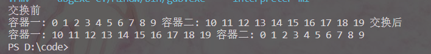

## 杂七杂八

这部分是在刷题过程中遇到的

### **priority_queue**

这是用的其实还是queue这个容器，这个在算法题里经常用来解决一些哈夫曼树的问题

```c++
#include <bits/stdc++.h>
using namespace std;
int main()
{
  //创建哈夫曼树
  priority_queue<int,vector<int>,greater<int>>a;
  int n;
  cin>>n;
  for(int i=0;i<n;i++){
    int temp;
    cin>>temp;
    a.push(temp);
  }
  int sum=0;
  while(a.size()>1){
    int x=a.top();
    a.pop();//顶层元素出栈
    int y=a.top();
    a.pop();//顶层元素出栈
    sum+=x+y;
    a.push(x+y);//将刚才顶层两个元素相加再入队
  }
  cout<<sum;
  return 0;
}
```

用这个容器实现起来很简单，创建的时候如果直接用**priority_queue<int.>a**这样就是默认的vector<int.>，而且将插入的元素从大到小排序的，greater就是指定从小到大排序的阿，符合我们创建哈夫曼树的要求，主要用于解决一些需要用到哈夫曼树的贪心问题

### string::npos

可以用于表示string的结束位置

```c++
#include<iostream>
int main(){
    string str = "123sadfa";
    if(str.find("sdf") == string::npos) cout<<"not found"<<endl;
    return 0;
}
```

### std::unordered_set

unordered_set 容器，可直译为“无序 set 容器”，即 unordered_set 容器和 set 容器很像，唯一的区别就在于 set 容器会自行对存储的数据进行排序，而 unordered_set 容器不会。

**2.特性**

1. 不再以键值对的形式存储数据，而是直接存储数据的值。
2. 容器内部存储的各个元素的值都互不相等，且不能被修改。
3. 不会对内部存储的数据进行排序（这和该容器底层采用哈希表结构存储数据有关）。

### std::unordered_map

相当于无序的map容器

## 总结

基本上每个容器的使用都差不多，可以看成是不同的数据结构

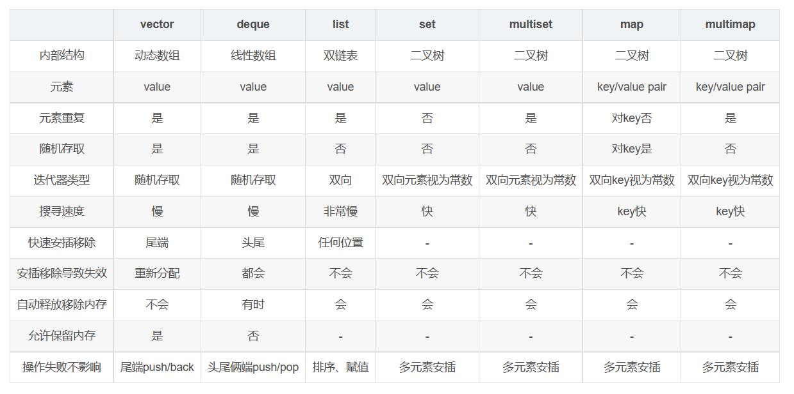

