## 一、前言

​	    vscode不同其他的集成ide，更像是一个轻量化的编辑器，集成的ide所有东西都是官方内置好了自带各种框架，但是ide一般来说运行速度是慢于vscode的，由于vscode强大的插件功能，vscode基本可以胜任大部分编程语言。但是由于vscode很多东西要自己配置所以相较于集成ide直接可以编译运行调试，vscode需要进行一些相关的设置，由于笔者也是新手所以有很多东西说的可能不是很清楚，或者有错误还请指出。

## 二、vscode的安装

这一部分我建议是直接观看B站小甲鱼的视频

视频链接：【在VSCode搭建C/C++环境【秒杀Visual C++/Dev C++]】 https://www.bilibili.com/video/BV1nt4y1r7Ez/?share_source=copy_web&vd_source=46305e689a1990fcb387e3066edbcdc8

基本步骤：

1.下载vscode

官方链接： [Visual Studio Code - Code Editing. Redefined](https://code.visualstudio.com/) 

2.下载MInGW编译器

官方链接： [MinGW-w64](https://www.mingw-w64.org/) 

3.安装插件：

除了视频里提到的必装的，还可以装以下的，看个人需求

### 插件推荐

vscode是默认英文的用这个设置中文


这个使用的可能会比较多，变量一般命名都是按照英文来的，要是那个变量的英文不会的话可以用中文来替代，然后右击翻译成驼峰格式的英文变量名

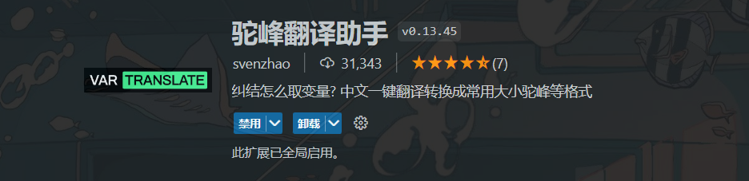


改变背景图片，效果如下图


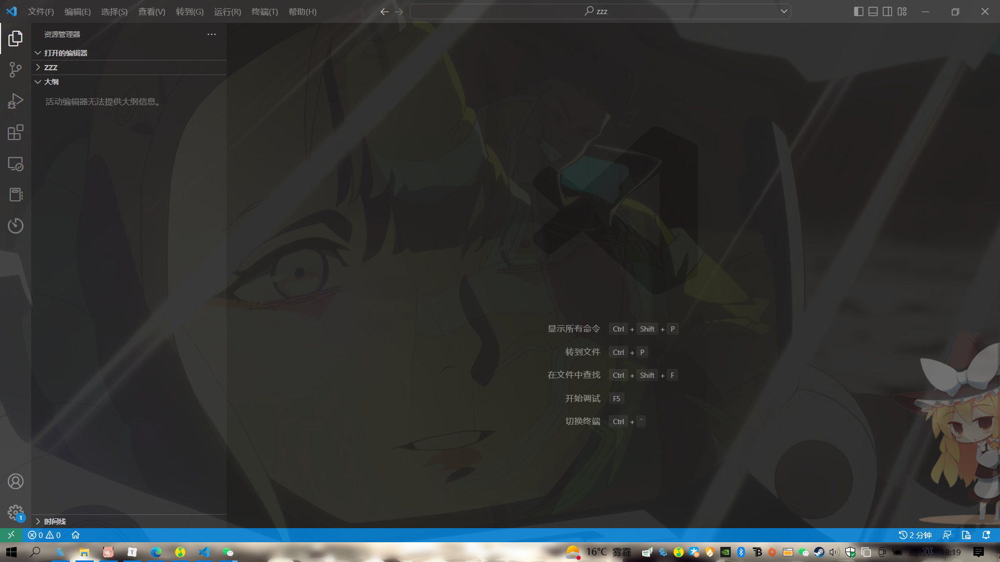


改变文件列表图标的美化插件


美化小人，还以加别的


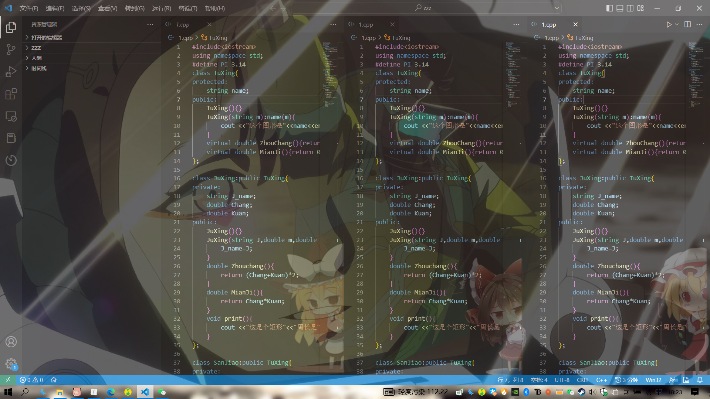


## 三、编译一个单文件

在你的电脑选取一个合适的位置创建一个空的文件价，我这个以D盘根目录下test文件为例子，两种创建方式，可以在vscode左上角文件按钮创建，也可以直接去D盘根目录创建test文件夹，然后以vscode方式打开

新建的文件目录是空的


### 1.创建一个CPP文件

右击目录后者点击上面的新建一个文件 test.cpp

```C++
#include<iostream>

int main(){
    std::cout<<"Hello world"<<std::endl;
    return 0;
}
```


### 2.编译运行

有三种方式可以运行

#### （1）黑窗口运行

如图直接点


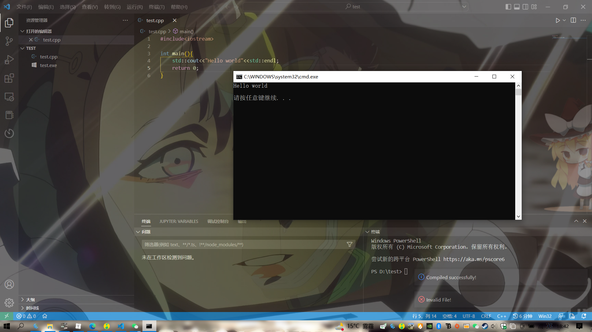

#### （2）输出窗口运行

直接在代码处右击Run Code


#### （3）终端窗口运行

重要啊，很重要啊

如图先换到终端窗口


在终端嵌入g++ .\test.cpp -o main.exe 回车，这个地方不用全打用Tab键是可以补全的

运行完之后会发现左边文件目录新出现一个main.exe

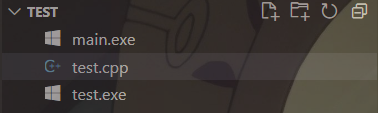

当然还有一个test.exe，不过如果你细心的会发现在用第一种黑窗口运行的时候就出现了这个文件，我们都知道源码文件文件想要运行是要由编译器驱动程序把源文件翻译成可执行文件的，这个翻译过程有四个阶段（预处理阶段----->编译器----->汇编器----->链接器）详细的可以看看csapp，总之最好是要形成一个.exe的可执行文件，而这个文件就和源码放在一起

你问为什么第二种没有新生成一个一个.exe，我的评价是我也不知道，我不过我认为应该是这两种运行方式本质是一样的，只是不同的输出方式（如果有大佬知道一定告诉我啊）

再在终端嵌入.\main.exe，然后就运行成功了

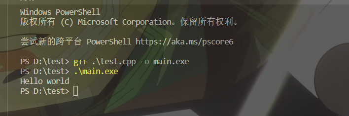

具体这个命令什么意思呢

g++就是使用g++编译器，同理如果是c语言源码就可以使用gcc编译器，g++ 后面紧跟的是要编译的文件，-o 是指定生成可执行文件，后面紧跟的是可执行文件名称，所以这个名称你可以自己随意命名，我这里就命名的main.exe，第一行命令就是编译源码，第二行的.\main.exe就是运行了

第一行命令还可以这样输入 g++ -g .\test.cpp -o a.exe，这个在第一个源码文件前多了一个-g，如图运行起来也没有错误，但是跟第一种有什么不同呢

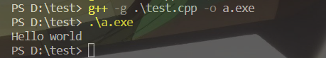 

在终端嵌入ls，ls就是查看当前目录的所有文件信息

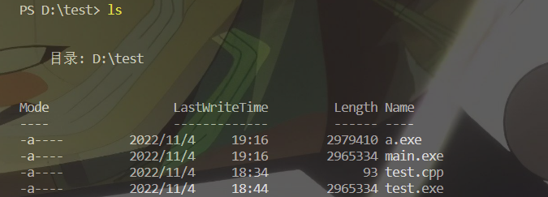

这里我们看到系统自动编译和我们不用 -g 编译出来的.exe文件大小是相同的，而用 -g 编译的a.exe是大于main.exe和test.exe的，这是因为用了 -g 的源文件包含了调试信息，所以 -g 编译的文件是可以调试的，**如果你刚开始接触vscode你的可能可以运行程序但是你不能调试，基本就是你直接编译运行的源码，这个生成的是不能调试的，这个时候问题就来了，那么不用自己指定编译的方式实现文件可以调试，这个时候就要涉及launch.json和task.json文件了**

## 四、配置文件和单文件编译

**首先配置文件绝对不能直接复制粘贴别人，可以直接用自动生成的简单改一下就可以了，直接用别人的连Mingw安装的位置都不一样是不可能成功的**

### 1.launch.json和tasks.json

按F5快捷键在弹出的窗口选择 C++(GDB/LLDB)

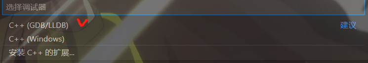

然后再选择g++.exe -生成和调试活动文件

这个时候如果你开始就已经配置好了而且可以正常调试运行（要是你直接弹出如图错误直接跳转--->2.“打开launch.json”情况），


就会在文件目录下自动生成一个.vscode文件不过配置好的里面没有launch.json文件，但是不影响简单的单文件调试


要想加launch.json文件的话如图

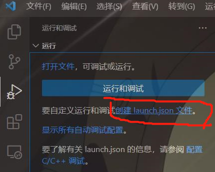

这个时候就会自动创建一个launch.json文件，

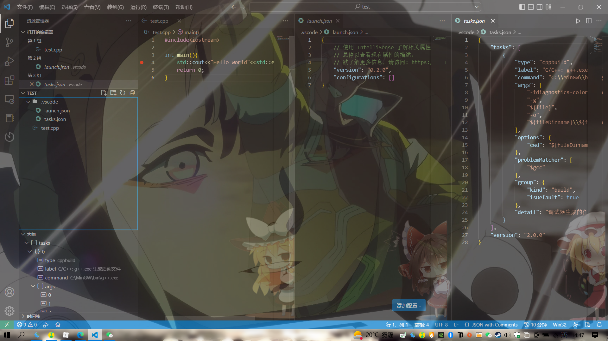

这里的launch.json文件只有两行


这个地方会有好几个选项，我也不是很懂这里，我一般都是用的是gdb：启动，然后就会自动在这个文件里生成配置文件

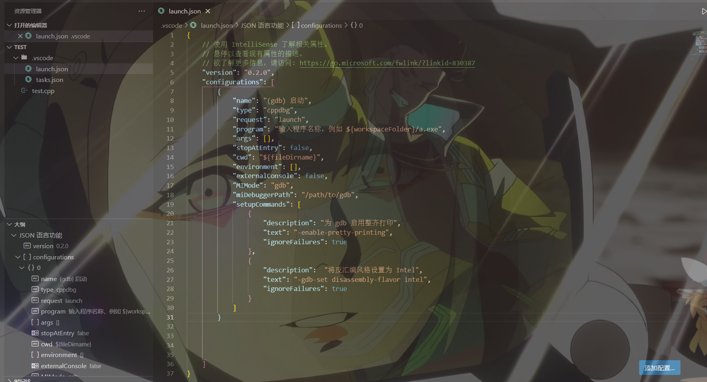

添加完成后，上面图一的那框就会变成这样

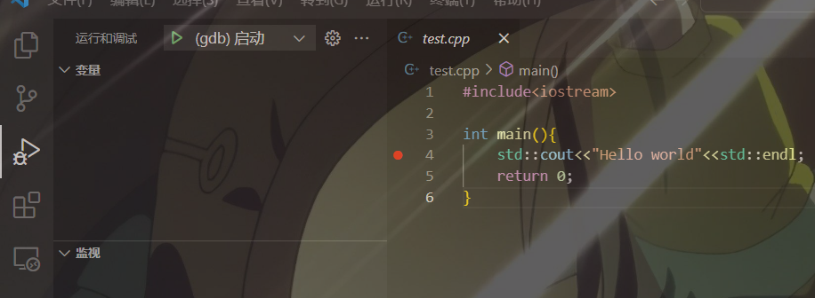

然后这个时候在按F5快速调试快捷键就会报错


### 2."打开launch.json"情况

点击打开"launch.json",就会跳转到我们刚才添加过的配置的launch.json文件（ 第一步进报错的，如果打开了launch文件如果也只有两行，往上翻），根据报错的提示就是因为我们没有配置launch.json文件就直接调试，尽管你开始没有添加这个文件的时候可以调试

初始的配置文件是

```json
{
    // 使用 IntelliSense 了解相关属性。 
    // 悬停以查看现有属性的描述。
    // 欲了解更多信息，请访问: https://go.microsoft.com/fwlink/?linkid=830387
    "version": "0.2.0",
    "configurations": [
        {
            "name": "(gdb) 启动",
            "type": "cppdbg",
            "request": "launch",
            "program": "输入程序名称，例如 ${workspaceFolder}/a.exe",//第一个要改的地方
            "args": [],
            "stopAtEntry": false,
            "cwd": "${fileDirname}",
            "environment": [],
            "externalConsole": false,
            "MIMode": "gdb",
            "miDebuggerPath": "/path/to/gdb",//第二个要改的地方
            "setupCommands": [
                {
                    "description": "为 gdb 启用整齐打印",
                    "text": "-enable-pretty-printing",
                    "ignoreFailures": true
                },
                {
                    "description":  "将反汇编风格设置为 Intel",
                    "text": "-gdb-set disassembly-flavor intel",
                    "ignoreFailures": true
                }
            ]
        }


    ]
}
```

但是只需要改两个位置就可以实现简单的调试

#### (1)修改program

```json
"program": "输入程序名称，例如 ${workspaceFolder}/a.exe",//第一个要改的地方
```

这个地方改成

```json
"program": "${workspaceFolder}/${fileBasenameNoExtension}.exe",
```

先把前面的中文删掉，后面的.exe文件名字是和tasks.json里面的一句相对应的

```json
            "args": [
                "-fdiagnostics-color=always",
                "-g",
                "${file}",
                "-o",
                "${fileDirname}\\${fileBasenameNoExtension}.exe"//和这里的.exe相对应
            ],
```

tasks.json是编译的配置文件，launch.json是调试的配置文件

${fileBasenameNoExtension}就是在当前用当前编译文件的名字作为可执行文件的名字，这个源文件我们命名的是test.cpp，所以它自动生成的可执行文件是test.exe，所以要我们把tasks.json里这一行改成"${fileDirname}\\main.exe"，这个时候就不会自动生成以当前编译文件的名字作为可执行文件的名字而是叫main.exe，如果不改相对应的launch.json文件就会出现以下错误


因为调试文件找的还是test.exe文件，但是编译配置文件tasks.json已经不生成test.exe，而是main.exe，所以launch文件找不到main.exe因此不能调试，如果要是反过来不变tasks文件改launch文件

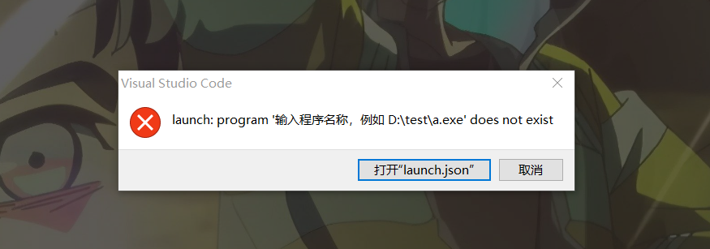

**又出现了这种情况，这也是很多刚接触vscode配置文件不会配置而去网上直接复制粘贴而出现的错误**

在换个思路，我们还可以自己用终端输入

```
g++ -g .\test.cpp -o main.exe
```

后面- o是我们自己指定生成的可执行文件的名称，我们把launch文件要改的第一个地方改成这样

```json
"program": "${workspaceFolder}/main.exe",
```

这里tasks是没有改的，如果没有我们自己指定生成main.exe文件是会报错的，但是我们这回自己指定了一个main.exe所以是可以正常调试，launch文件找到了一个和自己匹配的文件名称，尽管这个不与tasks指定生成的

因此launch文件里的那一行是可以不和tasks文件相同的，但是一般我们为了方便还是直接用${fileBasenameNoExtension}这个的，毕竟不用在麻烦自己去终端指定生成可执行文件名称，直接用源码的相同的就可以了。

**这个地方要说一下，启动tasks.json文件编译的快捷键是ctrl+shift+b，用这个编译方式生成的可执行文件就是${fileBasenameNoExtension}.exe这个，然后再快捷键F5就可以调试了**

#### (2)修改miDebuggerpath

```json
"miDebuggerPath": "/path/to/gdb",//第二个修改的地方
```

path to gdb 就是添加gdb.exe的文件呗，找到自己的gdb.exe文件的绝对路径添加


#### (3)修改tasks.json

tasks文件是修改两个位置，第一个位置在上面已经说过了

第二个位置

```c++
"command": "C:\\MinGW\\bin\\g++.exe",
```

这里修改成自己编译器的路径，不过这里好像是自动生成的，如果不对的话是需要修改的，对的话就不改了

### 3.简单的注释

#### (1)launch.json

```json
{
    "configurations": [
        {
            "name": "(gdb) 启动",//选择的配置名称
            "type": "cppdbg",//c++的debug
            "request": "launch",//配置类型
            "program": "${workspaceFolder}/${fileBasenameNoExtension}.exe",//需要调试的文件的路径，
            //${workspaceFolder}就是调试文件的目录，
            //${fileBasenameNoExtension}就是你按下调试时正打开的文件的文件名，与tasks.json的args下的-o指定的名称对应
            "args": [],
            "stopAtEntry": false,//再main开始处添加一个断点
            "cwd": "${fileDirname}",//调试文件的目录
            "environment": [],
            "externalConsole": false,//是否启用黑窗口调试
            "MIMode": "gdb",//调试器，这里用的就是gdb
            "miDebuggerPath": "C:\\MinGW\\bin\\gdb.exe",//重中之中，你调试器的文件目录
            "setupCommands": [
                {
                    "description": "为 gdb 启用整齐打印",
                    "text": "-enable-pretty-printing",
                    "ignoreFailures": true
                },
                {
                    "description":  "将反汇编风格设置为 Intel",
                    "text": "-gdb-set disassembly-flavor intel",
                    "ignoreFailures": true
                }
            ]
        }

    ]
}
```

#### (2)tasks.json

```json
{
    "tasks": [
        {
            "type": "cppbuild",//编译类型这里是c++的
            "label": "C/C++: g++.exe 生成活动文件",
            "command": "C:\\MinGW\\bin\\g++.exe",//要使用的编译器路径
            "args": [//这些就是我们在终端编译时后面跟的参数，这里只写了-g 和 -o但是其实还有别的不过单文件编译这就够了
            //多文件编译还会改这里，还有-I的是添加头文件的
                "-fdiagnostics-color=always",
                "-g",//调试信息
                "${file}",
                "-o",//生成的可执行文件路劲
                "${fileDirname}\\${fileBasenameNoExtension}.exe"
            ],
            "options": {
                "cwd": "${fileDirname}"
            },
            "problemMatcher": [
                "$gcc"
            ],
            "group": {
                "kind": "build",
                "isDefault": true//开启编译快捷键ctrl_shift+b
            },
            "detail": "调试器生成的任务。"
        }
    ],
    "version": "2.0.0"
}
```

有一些我没有注释的是一些用的不太多的，然后就是我也懂得比如

```json
setupCommands": [
                {
                    "description": "为 gdb 启用整齐打印",
                    "text": "-enable-pretty-printing",
                    "ignoreFailures": true
                },
                {
                    "description":  "将反汇编风格设置为 Intel",
                    "text": "-gdb-set disassembly-flavor intel",
                    "ignoreFailures": true
                }
            ]
        }

    ]
```

这一段我也不是很明白，有些我说的不是很明白的可以把指针听到相应的key，很有提示

## 五、多文件编译

### 1.终端编译

首先还是利用终端来进行多文件的编译先来感受一下捏

在你的文件夹中在新建两个文件hello.cpp，和hello.h

hello.cpp文件

```C++
#include<iostream>
#include"hello.h"
void print(){
    std::cout<<"hello world"<<std::endl;
}
```

hello.h文件

```C++
#ifndef _HELLO_H
#define _HELLO_H
void print();
#endif
```

这个时候的文件目录（不用的.exe文件是可以直接删除的）

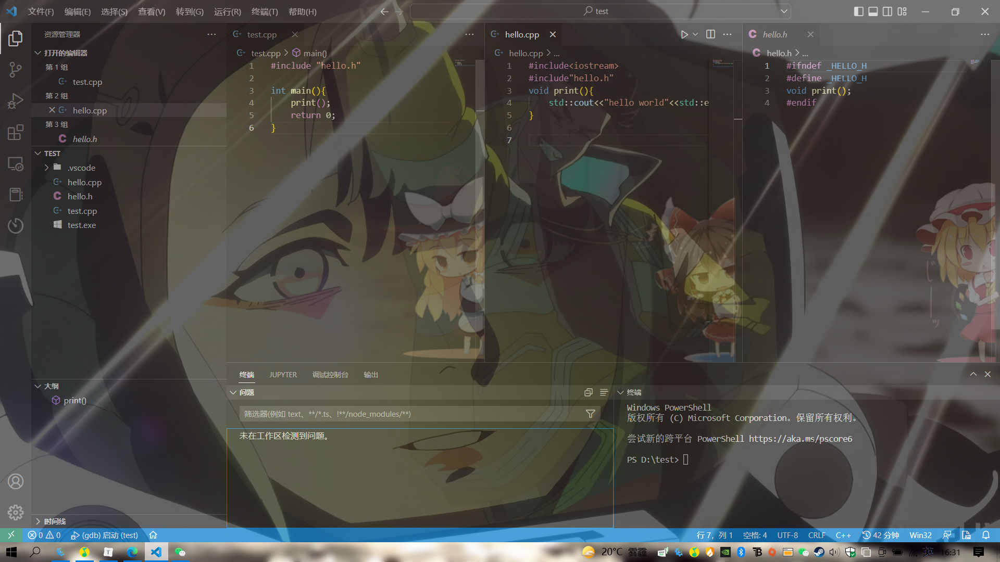

然后在终端运行

```
g++ .\test.cpp .\hello.cpp -o main.exe
```

然后在

```
.\main.exe
```

然后就成功了额

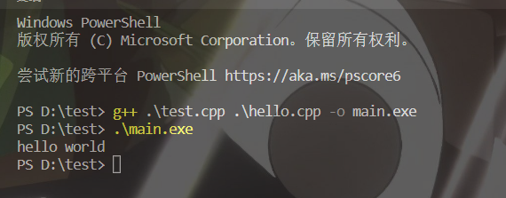

然后你要想直接已经配置好了两个文件是不是这个也可以直接编译然后调试捏，你可以试一试先ctrl+shift+B编译结果就是报错了，害编译都不能过，单文件和多文件还在不一样的，多文件了之后还要再改一下配置文件才能调试

### 2.直接编译

有了前面的基础，这里我们只需修改tasks.json文件里的arg[] 

```json
  "-g",//调试信息
  "${workspaceFolder}\\*.cpp",
```

*cpp代表把这个工作目录下的所有cpp都编译了

然后在ctrl+shift+b就可以正常编译了，然后再F5就可以正常调试了

但是我们这里的文件目录是这样的

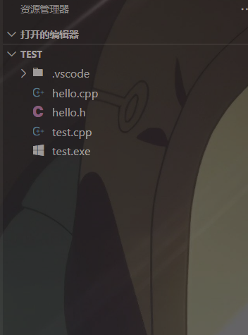

实际上我们会为源文件创建一个source文件夹，给头文件创建一个head文件，这个时候就是这样了

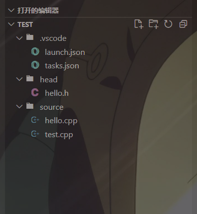

这里也可以配置两个文件来进行编译的不过我的建议是用cmake来编译

## 六、CMake使用

### 1.安装

首先在你的电脑安装CMake，安装教程： [(65条消息) Windows下Cmake安装步骤详解（图文）_L_Li_L的博客-CSDN博客_windows安装cmake](https://blog.csdn.net/qq_42598221/article/details/121952160) 

然后就是vscode插件的安装

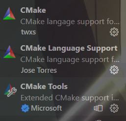

### 2.CMake编译

现在你在项目目录创建两个文件

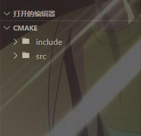

include用来放你头文件，src用来放你的源码，然后再根目录下创建一个CMake文件叫做**CMakeLists.txt这个文件名是固定的**然后在其中添加语句

```cmake
project(SortMake)
aux_source_directory(src DIG_F)
add_executable(main ${DIG_F})
include_directories(include)
```

project()//设置项目的名称

aux_source_directory(src DIG_F)搜索src目录下所有源文件，并将列表存在变量，这两个变量可以看需修改（第二个参数相当于名字可以随便命名）

add_executable(main ${DIG_F})指定使用源文件DIG_F(跟上一句的对应)，生成可执行文件的名称main(这个名称自己可以随便命名)

include_directories(include)设置包含头文件的目录

然后分别在include和src文件中添加源码

再快捷键ctrl+shift+p 在搜索框搜索CMake configure

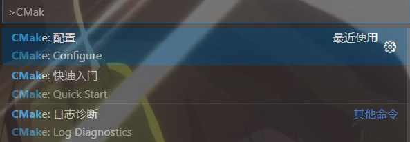

然后再选择GCC后面跟的是你的版本号，配置完成后vscode工作目录会出现一个build目录

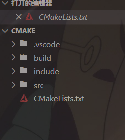

然在在终端执行

```
cd build
```

cd就移动到指定的文件夹目录下，然后执行

```
cmake ..
```

再然后生成makefile文件构造项目，这一步在linux是make，但是在windows的Mingw上是

```
mingw32-make.exe
```

然后可以执行文件就生成到了build目录里面

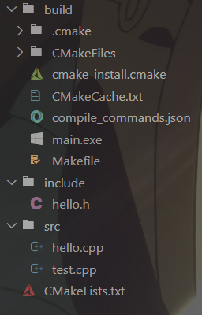

到这里可执行文件也成功生成了但是要怎么运行调试捏，又要配置两个文件了，launch文件基本没什么变化，主要是tasks的变化

### 3.CMake多文件调试

还是先创建launch文件和tasks文件

(1)launch.json

```json
{
    // 使用 IntelliSense 了解相关属性。 
    // 悬停以查看现有属性的描述。
    // 欲了解更多信息，请访问: https://go.microsoft.com/fwlink/?linkid=830387
    "version": "0.2.0",
    "configurations": [

        {
            "name": "(gdb) 启动",
            "type": "cppdbg",
            "request": "launch",
            "program": "${workspaceFolder}/build/main.exe",
            "args": [],
            "stopAtEntry": false,
            "cwd": "${fileDirname}",
            "environment": [],
            "externalConsole": false,
            "MIMode": "gdb",
            "miDebuggerPath": "C:\\MinGW\\bin\\gdb.exe",
            "setupCommands": [
                {
                    "description": "为 gdb 启用整齐打印",
                    "text": "-enable-pretty-printing",
                    "ignoreFailures": true
                },
                {
                    "description":  "将反汇编风格设置为 Intel",
                    "text": "-gdb-set disassembly-flavor intel",
                    "ignoreFailures": true
                }
            ]
        }

    ]
}
```

(2)tasks.json

```json
{
    "version": "2.0.0",
    "options": {
        "cwd": "${workspaceFolder}/build/"
    },

    "tasks": [
        {
            "label": "cmake",
            "type": "shell",
            "command": "cmake",
            "args": [
                ".."
            ]
        },
        {
            "label": "make",
            "group":{
                "kind":"build",
                "isDefault":true
            },
            "command": "mingw32-make.exe",
            "args":[
            ]
        },
        {
            "label":"Build my project",
            "dependsOn":[
                "cmake",
                "make"                
            ]
        }
    ]
}
```

launch文件还是和上面一样修改

```
"program": "${workspaceFolder}/build/main.exe",
```

这个生成的可执行文件在build目录下，而且这里同样是和tasks文件相对应的

    "options": {
        "cwd": "${workspaceFolder}/build/"
    },

要和cwd里的路径对应。

tasks文件基本就可以直接复用这段代码就可以了不需要修改的，还有就是这里生成的可执行文件的名称是我们在CMakeLists.txt里面指定的，在两个配置文件里不能修改了

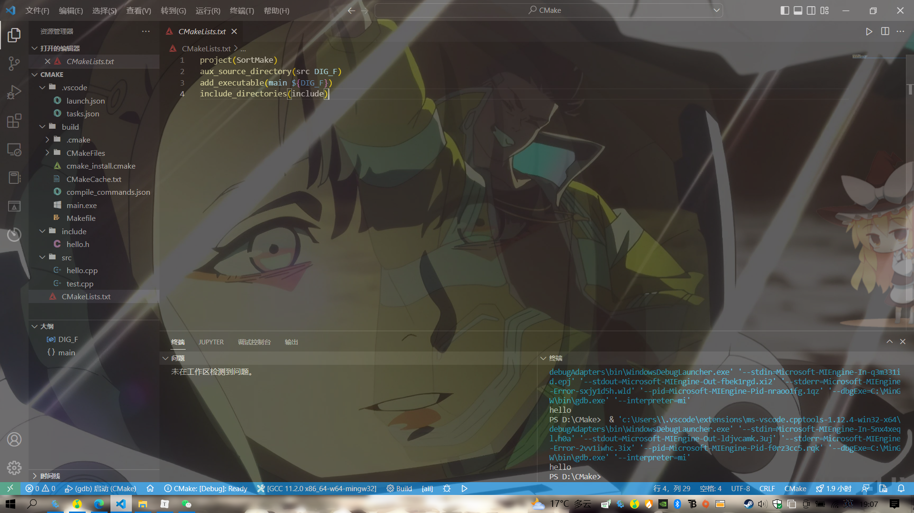

接着F5就可以成功调试了，也可以ctrl+F5不在调试模式运行

## 七、小结

基本上就上这样的了，当然这都是最基础的开发环境了